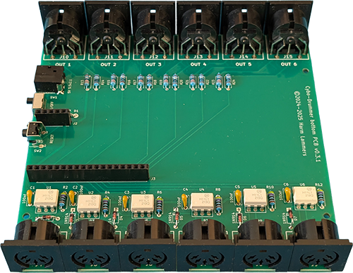
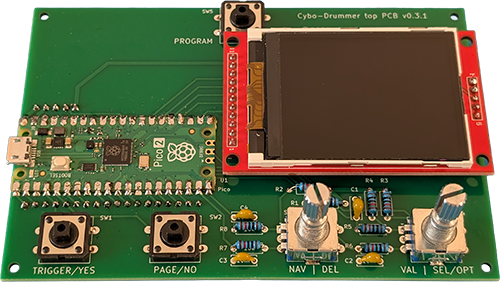
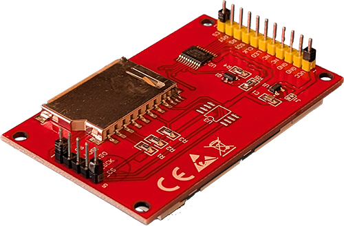
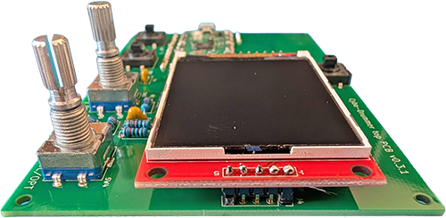
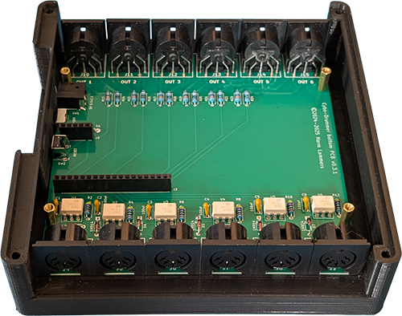
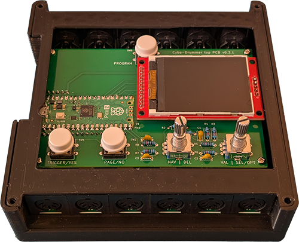

<header>


# Cybo-Drummer

**Humanize those drum computers!**

&copy; 2024&ndash;2025 Harm Lammers
</header>
<main>

# Building Instructions

This file is part of a series of documentation files on Cybo-Drummer:

* [README file](README.md) with brief introduction
* [User Manual](USER_MANUAL.md)
* Building Instructions (this file)
* [Example Presets](EXAMPLE_PRESETS.md)

# Introduction

The first Cybo-Drummer prototypes were building upon an existing design by [diyelectromusic (Kevin)](https://diyelectromusic.com), using that design as the bottom PCB with the MIDI ports ([Raspberry Pi Pico Multi MIDI Router](https://diyelectromusic.com/2022/09/19/raspberry-pi-pico-multi-midi-router-part-5)), adding a second PCB on top which connected to the Raspberry Pi Pico headers on Kevin&rsquo;s PCB.

Version 0.3 is a completely new hardware design, still taking inspiration from Kevin&rsquo;s design, but much better tailored to Cybo-Drummer&rsquo;s requirements. It also marks a switch from the original Raspberry Pi Pico to the Raspberry Pi Pico 2, which, with about twice as much RAM, solves a lot of issues which were related to running into memory limitations.

***I have no intention to sell Cybo-Drummer as a fully assembled product, nor as DIY kit.*** &ndash; I might change my mind in the future, but for now that doesn&rsquo;t seem like a realistic idea, next to a full-time job and a family (especially because I expect it to be a very niche product &ndash; unless a change in trend occurs and many more drummers become interested again in electronic drums as an instrument of its own &ndash; like in the 1980s &ndash; instead of a means to simulate acoustic drums). Nevertheless: if you think you can convince me to change my mind, feel free to try!

> [!IMPORTANT]
> This file provides building instructions for version 0.3 of the Cybo-Drummer hardware. Hardware and software versions before version 0.3 are not compatible with version 0.3 (and vice versa).

## Hardware

Building the Cybo-Drummer hardware only requires basic soldering skills (it uses only though-hole components). The PCBs can be ordered relatively cheaply from Chinese PCB services like [JLCPCB](https://jlcpcb.com) (no affiliate). The front panel is a PCB as well, the rest of the case can be 3D printed.

### BOM (Bill of Materials)

* Zip files with Gerber files for the top PCB, bottom PCB can be found in the [Gerber files folder](gerber_files/) &ndash; order them from your favourite PCB service (I&rsquo;ve successfully used these to order PCBs from [JLCPCB](https://jlcpcb.com), which is no affiliate)
* The front panel is also a PCB, Gerber files for which can be found in the [Gerber files folder](gerber_files/) as well
* STL files for the two parts of the 3D printed case (top and bottom) can be found in the [STL files folder](stl_files/) &ndash; I&rsquo;ve printed successfully on an old (highly modified) Creality Ender 3 Pro printer, but they should work on any printer, or you can order them from a printing service

> [!NOTE]
> Schematics for the top and bottom PCBs can be found in the [schematics folder](schematics/).

#### Bottom PCB

* Cybo-Drummer bottom PCB v0.3.2 (in [Gerber files folder](gerber_files/))
* 6× H11L1 optocoupler
* 6× 470&Omega; resistor
* 6× 220&Omega; resistor
* 6× 33&Omega; resistor
* 6× 10&Omega; resistor
* 6× 1N914 or 1N4148 diode
* 1× 1N5817 diode
* 6× 100&mu;F ceramic capacitor with 5mm spacing
* 1× [SK-12D07(1P2T) switch](https://www.tinytronics.nl/en/switches/manual-switches/slide-switches/small-switch-90-degrees-extra-strong)
* 1× [6×6×6mm momentary tactile button](https://nl.aliexpress.com/item/10000056364450.html)
* 1× [DC-044 5.5×2.1 DC jack](https://www.tinytronics.nl/en/cables-and-connectors/connectors/dc-jack/dc-jack-plastic-5.5mm-female-dc-044)
* 12× [DS-5-01 5-pin DIN PCB mount socket](https://nl.aliexpress.com/item/1005005377343340.html) (double-check the footprint on the PCB, because there are similar sockets on the market with slightly different spacings of the soldering pins!)
* 1×5 female pin header socket (tip: shorten a longer socket)
* 1×18 female pin header socket (tip: shorten a longer socket)

#### Top PCB

* Cybo-Drummer top PCB v0.3.1 in ([Gerber files folder](gerber_files/))
* Raspberry Pi Pico 2 without headers (from version 0.3 Cybo-Drummer is no longer compatible with the original Raspberry Pi Pico &ndash; it requires mark 2!)
* [2.2" 176×220 TFT display board with ILI9225 driver](http://www.lcdwiki.com/2.2inch_Arduino_SPI_Module_ILI9225_SKU:MAR2201) &ndash; sold for example [here](https://www.tinytronics.nl/en/displays/tft/2.2-inch-tft-display-176*220-pixels)
* 8× 10k&Omega; resistor
* 4x 10nF ceramic capacitor with 5mm spacing
* 2× EC11 rotary encoder
* 3× [12×12×7.3mm 4-pin THT momentary tactile button](https://www.tinytronics.nl/en/switches/manual-switches/pcb-switches/tactile-pushbutton-switch-momentary-4pin-12*12*7.3mm)
* 2× 1×5 male pin header
* 1× 1×18 male pin header
* 4× 1×1 male header spacers (only the plastic part with the metal pin removed)

#### Case

* Cybo-Drummer case bottom part v3.0 (in [STL files folder](stl_files/))
* Cybo-Drummer case top part v3.0 (in [STL files folder](stl_files/))
* Cybo-Drummer front panel PCB v0.3.1 in ([Gerber files folder](gerber_files/))
* 4× M4×6×6 brass heat-set inserts (not necessarily needed if you have no intention to use a mounting plate)

#### Final Assembly

* 4× M2.5×5 pan head screw
* 4× M2.5×12 pan head screw
* 4× M2.5×11 spacers
* 4× M3×35 hex socket head cap screw (black)
* 4× M3 bolt
* 1× [LC5-3 5mm LED light guide cap](https://nl.aliexpress.com/item/1005008732919698.html) (general style)
* 3× [Round 11.×5.7mm button cap](https://www.tinytronics.nl/en/components/knobs,-caps-and-covers/button-cap-for-tactile-pushbutton-switch-momentary-12x12x7.3mm-white)
* 2× [15×17mm rotary encoder / potentiometer knob](https://www.tinytronics.nl/en/components/knobs,-caps-and-covers/potmeter-knob-black)
<br clear="right"/>

### Building Instructions



#### Bottom PCB

Assemble the top PCB by following the following steps:

  1. Solder all **resistors** and **diodes**
  2. Solder all **H11L1 optocouplers** (U1 to U6)
  3. Solder all **capacitors**
  4. Solder the **on/off switch** (SW1)
  5. Solder the **reset button** (SW2) and the **DC power socket** (J1)
  6. Solder the **1×5 and 1×18 female pin header sockets** (J2 and J3)
  7. Solder all the **DIN MIDI sockets** (J4 to J15)

<br clear="right"/>



#### Top PCB

Assemble the top PCB by following the following steps:

  1. Solder the **Raspberry Pi Pico 2** directly onto the Cybo-Drummer top PCB, without any headers (those would add too much height)
  2. Solder all **resistors**
  3. Solder all **capacitors**
  4. Solder all **buttons** (SW1, SW2, SW5)
  5. Prepare the display by:
     1. soldering an additional **1×5 male pin header to the display board** (these are only used to fixate the display board to the Cybo-Drummer top PCB)
     2. add the 4 **1×1 male header spacers to the male pin headers on the display board** as can be seen on the photo on the right
  6. Solder the **display board** directly onto the Cybo-Drummer top PCB, without female headers (but with the additional spacers!)
  7. Solder the **rotary encoders** (SW3, SW4)
  8. Solder the second **1×5 male pin header** and the **1×18 male pin header *onto the bottom of the PCB*** (J1, J2)

The result should look like on the photo on the right.

> [!TIP]
> Use a few short pin headers to keep the Raspberry Pi Pico 2 perfectly aligned before fixating the Pico by soldering each corner. Then remove the pin headers and finishing soldering each castellated pad.

* Plug the second board to Pico header sockets of the first board and fix them together using four spacers
* Plug the Raspberry Pi Pico into the 2x 20-pin header sockets on the second board

#### 3D Print Case

* The case can be printed in PLA (that&rsquo;s what I&rsquo;ve used for the prototypes so far), but if used, stored or transported in hot environments I advise a more heat-resistant material like PETG or ABS
* No printing supports are needed, but that might cause some obstructions in recessed screw holes in the bottom of the case &ndash; use for example a small screwdriver to clean the holes before assembling the case
* Insert the brass inserts into the four holes in the bottom of the case which do not go through all the way (see for example [this website](https://www.cnckitchen.com/blog/tipps-amp-tricks-fr-gewindeeinstze-im-3d-druck-3awey) for instructions on how to insert brass heat-set inserts) &ndash; this step might be skipped if you have intention to use a mounting plate
<br clear="right"/>




#### Assembly

1. Place the bottom PCB into the bottom part of the case, such that the switches and power socket on the left side align with the holes in the side of the case and the four holes in the bottom PCB
2. Insert the four M2.5×12 pan head screws through the bottom of the case, such that they go through the holes in the bottom PCB and fasten them with the four M2.5×11 spacers
3. Insert the top PCB on top of the bottom PCB, such that the top PCB&rsquo;s male pin headers insert into the bottom PCB&rsquo;s female pin headers and the holes in the top PCB align with the spacers
4. Use the four M2.5×5 pan head screws to fasten the top PCB into the spacers
5. Click the three button caps onto the TRIGGER/YES, PAGE/NO and PROGRAM buttons
6. Insert the top part of the case, such that it follows the shape of the top of the case and the round holes are aligned with the holes in the corner of the case
7. Insert the LED light guide cap into the front panel PCB (into the hole between &lsquo;USB&rsquo; and &lsquo;TRIGGER/YES&rsquo;)
8. Place the front panel PCB on to of the case such that all the holes align with the screen, buttons, rotary encoders and holes in the corner of the case
9. Insert the four M3×35 hex socket head cap screws from the bottom through the corners of the case and fasten them with the four M3 bolts from the bottom of the case (the bolts should sink into the bottom of the case)
10. Slide the two knobs over the rotary encoders

## Software

The easiest way to install the software is by downloading the [latest firmware](https://github.com/HLammers/cybo-drummer/releases) as a single file and uploading it the Cybo-Drummer, but it can be run directly from source as well.

> [!NOTE]
> Cybo-Drummer offers a couple of key combinations specifically for debugging and firmware upload purposes:
>
> <table>
> <tr><td><b>RESET</b></td><td>Resets Cybo-Drummer</td></tr>
> <tr><td><b>RESET + TRIGGER</b></td><td>Avoids starting Cybo-Drummer&rsquo;s main loops <i>(the user interface and the router) and allows a PC to interact over USB &ndash; press the RESET button while keeping the TRIGGER button pressed until the PC made a connection (after the Raspberry Pi Pico&rsquo;s LED flashed)</i></td></tr>
> <tr><td><b>RESET + TRIGGER + PAGE</b></td><td>Starts bootloader<i> (show Cybo-Drummer as drive called RPI-RP2 on your PC for uploading firmware) &ndash; press the RESET while keeping the TRIGGER and PAGE buttons pressed until the RPI-RP2 drive appears on your PC (after the Raspberry Pi Pico&rsquo;s LED flashed) &ndash; this is an alternative to BOOTSEL + RESET for when the BOOTSEL button is hidden behind the front panel</i></td></tr>
> </table>

### Uploading Firmware

* Back up your user settings (see warning below)
* Download the [latest firmware release](https://github.com/HLammers/cybo-drummer/releases) (.uf2 file)
* Connect Cybo-Drummer with a USB cable to your PC of choice (running Windows, Linux or MacOS)
* Do one of the following to make the Cybo-Drummer appear as a drive called RPI-RP2 on your PC:
  * Press the RESET button and wait for the LED on the Raspberry Pi Pico to turn on; in the 1 second the LED is on, press and keep the TRIGGER and PAGE buttons pressed until the RPI-RP2 drive appears on your PC
  * Keep the Raspberry Pi Pico&rsquo;s BOOTSEL button pressed and keep the RESET button pressed until the RPI-RP2 drive appears on your PC
* Copy the firmware file to the PRI-RP2 drive &ndash; Cybo-Drummer will automatically restart with the new firmware
* Restore your user settings (see warning box below)

<!--update version number in the three references to MicroPython below when necessary, as well as in the EXAMPLE_PRESETS.md file!-->

> [!WARNING]
> ***Uploading new firmware might delete your user settings (including user-defined programs) and reinstate default values!***
>
> User settings are stored internally in a file folder called data_files. Currently the easiest way To back-up (download) or restore (upload) the file is by following these steps (assuming you&rsquo;re using a Windows PC):
>
> * If you haven&rsquo;t before: Install [Python](https://www.python.org/downloads) &ndash; follow the instructions provided [here](https://docs.python.org/3/using/windows.html#windows-full) and **make sure to select &lsquo;Add Python 3.x to PATH&rsquo;**
> * If you haven&rsquo;t before: Download the source code of [MicroPython release v1.25.0](https://github.com/micropython/micropython/releases). (typically the zip version) and unzip it somewhere on your PC
> * In File Explorer go to the micropython-1.25.0\tools\mpremote folder (in the location where you unzipped MicroPython)
> * Right click somewhere in the folder (not on a file) and from the context menu select &lsquo;Open in Terminal&rsquo;
> * If you do it for the first time: type the following to install required Python modules:
>
>   ```
>   pip install pyserial
>   pip instal importlib_metadata
>   ```
>
> * *To back up user settings:*
>   * On your PC type `py mpremote.py fs cp -r :data_files/ .` **without pressing ENTER** (so not executing it yet)
> * *To restore user settings:*
>   * Copy your data_files to the micropython-1.25.0\tools\mpremote folder
>   * On your PC type `py mpremote.py fs cp -r data_files/ :` **without pressing ENTER** (so not executing it yet)
> * While you keep Cybo-Drummer&rsquo;s TRIGGER button pressed:
>   * Press RESET button on Cybo-Drummer
>   * Press ENTER on your PC to start downloading (backing up) or uploading (restoring)

### Running From Source

It is possible to run Cybo-Drummer from source by uploading the content from the [src folder](src/) to the Raspberry Pi Pico running [stock MicroPython](https://micropython.org/download/RPI_PICO).

Keep in mind that when running from source (instead of frozen into firmware), Cybo-Drummer takes more time to boot. To resolve this while playing around with the code it is also possible to freeze only part of the source code, following the instructions under [building firmware from source](#building-firmware-from-source).

### Building Firmware From Source

So far I haven&rsquo;t found an easy way to build MicroPython on a Windows PC, only on a device running Debian Linux, so I&rsquo;m using a Raspberry Pi 400 for this purpose, but any Raspberry Pi 4 or 5 running Raspberry OS will do.

To build Cybo-Drummer follow these steps:

* *First time you build Cybo-Drummer*: In the Raspberry Pi console type (this creates a /home/pi/pico folder to with the MicroPython source code):

```
cd ~/
mkdir pico
cd pico
git clone https://github.com/micropython/micropython.git --branch master
cd micropython
git checkout v1.25.0
sudo apt update
sudo apt install cmake gcc-arm-none-eabi libnewlib-arm-none-eabi build-essential
make -C mpy-cross
```

* Copy all files from the [src folder](src/) except screen_log.py and the data_files folder to the /home/pi/pico/micropython/mpy-cross/ folder
* Remove all files (from previous Cybo-Drummer builds) from the /home/pi/pico/micropython/ports/rp2/modules folder, except the default files main.py, _boot.py, _boot_fat.py and rp2.py
* In the Raspberry Pi console type the following to pre-compile each .py file you just copied (except main.py, which needs to be frozen as a .py file), delete them afterwards (the `-O3` option, which stands for optimization level 3, makes sure `__debug__` is False and all debugging code is left out) and move results to the /home/pi/pico/micropython/ports/rp2/modules folder (to freeze them into the firmware):

```
cd ~/pico/micropython/mpy-cross
for f in *.py; do [ "$f" != "main.py" ] && python3 -m mpy_cross -march=armv7emsp -O3 $f; [ "$f" != "main.py" ] && rm $f; done
mv {*.mpy,*.py} ../ports/rp2/modules/
```

* Now to build the firmware type in the Raspberry Pi console:

```
cd ~/pico/micropython/ports/rp2
make BOARD=RPI_PICO2 submodules
make BOARD=RPI_PICO2 clean
make BOARD=RPI_PICO2
```

* The freshly built firmware is stored as /home/pi/pico/micropython/ports/rp2/build-RPI_PICO2/firmware.uf2

> [!TIP]
> An easy way to copy the Cybo-Drummer source code from a PC to the modules folder on a Raspberry Pi is by [setting up Samba on the Raspberry Pi](https://fernandezvictor.medium.com/raspberry-pi-as-samba-server-to-create-shared-folder-between-computers-cdea979092b8) and turn the home/pi/pico folder into a shared folder.

</main>