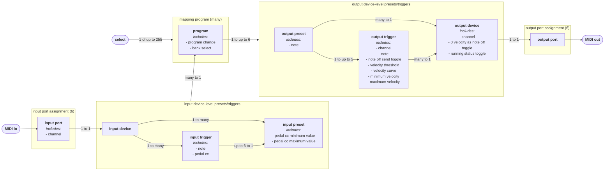

# Cybo-Drummer
**Humanize those drum computers!**

(c) 2024 Harm Lammers

> [!IMPORTANT]
> Cybo-Drummer is not yet released. This readme file is work in progress in preparation of releasing Cybo-Drummer to the public. Feel free to come back here to see it grow for the next couple of weeks!


> [!NOTE]
> This is my very first [Python/MicroPython](#why-in-micropython) project, my first PCB design (learning still!) and generally the first microcontroller-based project I developed from scratch and I actually brought to the finish line. It has been a learning experience, but by no way I’d say it's perfect, so I'm happy to receive your feedback on the hardware, the software, the feature set, a bug you found or anything you’d like to share.
>
> Are you an experienced drummer (I’ve only been drumming for about 1.5 year – too much of which I’ve spent on this project instead of practicing…) with a fascination for synthesized drum sounds? I’d love to hear how you experience using Cybo-Drummer. What would you change? What features are you missing?
>
> Ofcourse I’m open for collaboration. Just let me know how you think you can contribute!
>
> Please use the [issues tab](issues/) to report bug and other issues, or the [discussion tab](discussions/) to discuss anything else.
## Introduction
I own an electronic drum kit and a bunch of drum computers and my dream was to use the former to play the latter, so I went searching for a way to do just that – allowing me to easily switch between different configurations combining the sounds of one or more drum computers. I looked for hardware solutions, but couldn’t find any. I looked for software solutions, but I could only find MIDI mappers or other complex solutions that would never give me the easy to use experience I had it mind. It turns out that (as usual) I go against the current fashion of trying to make an electronic drum kit sound (and look) as acoustic as possible. So I decided to develop my own solution – and publish it as open source DIY project, hoping it finds like-minded drummers!
## What Is It?
Cybo-Drummer is a MIDI router/mapper with 6 input ports and 6 output ports, specially designed for mapping drum triggers (electronic drum kits’ brains) to drum computers. Since there is no standard for the MIDI messages sent by drum kits, nor the messages received by drum computers, Cybo-Drummer offers a flexible way of mapping the one to the other.

The idea for the hardware was inspired by the work of [diyelectromusic (Kevin)](https://diyelectromusic.com/), in particular his [Raspberry Pi Pico Multi MIDI Router](https://diyelectromusic.com/2022/09/19/raspberry-pi-pico-multi-midi-router-part-5/). The first prototype is an additional PCB on top of the Multi Midi Router.
### Features
#### Hardware
* 6 times 5-pin DIN MIDI input port: connect up to 6 drum kits, drum pads, keyboards, etc.
* 6 times 5-pin DIN MIDI output port: connect up to 6 drum computers, samplers, synthesizer, etc.
* micro USB port for power and firmware update (MIDI over USB is not yet implemented; next prototype will include 5.5mm socket for 5V DC power supply)
* 2.2 inch colour display (220×176 pixels)
* 2 rotary encoders and 2 push buttons for input and navigation (plus reset button)
#### Mapping

* Flexible layered approach to mapping:
  * Define input and output devices and trigger definitions – a trigger is always associated to a specific device
  * Assign input and output triggers to presets – one preset can be linked to multiple triggers and the same trigger can be linked to multiple presets (mixing different devices)
  * Assign multiple input and output presets to each other in programs to quickly switch between different configurations
  * Limits:[^1] 255 programs, 4,096 devices, 4,096 presets – there’s no hard limit to the number of triggers
* Send program change and/or bank select commands on program change
* Set trigger dependency to cc value (for example to distinguish between open and closed hi-hat from many drum modules)
* Supports both one note per sound on the same channel and one sound per channel, or a combinations of both – including tonal mapping
* Adjust velocity dynamics (threshold, curve, minimum velocity, maximum velocity)
[^1]: The available memory also limits the number of programs, devices presets and triggers
> [!NOTE]
> **<ins>Cybo-Drummer Mapping Terminology</ins>**\
> ***Input device:*** A drum kit, drum pad, keyboard or other device that outputs MIDI data\
> ***Input trigger:*** The MIDI note that is been sent by an input device when playing a drum pad, key, etc.\
> ***Input preset:*** A combination of input triggers and optional foot pedal settings that can be assigned to trigger an output preset\
> ***Output device:*** A drum computer, sampler, synthesizer or other device that responds to MIDI data\
> ***Output trigger:*** The MIDI channel and/or note that triggers a sound in the output device\
> ***Output preset:*** A combination of output triggers and optional note that can be assigned to be triggered by an input preset\
> ***Program:*** A mapping of one or more input presets to one or more output presets plus optionally program change and/or bank select commands to be sent to output devices
#### Other Features
* MIDI learn: Set one of the input ports to receive midi learn data (note values, channel values, cc numbers, etc.)
* MIDI thru: Set all data[^2] received on one of the input ports to be sent unaltered to one of the output ports 
* MIDI monitor with three views: Show mapping flow (input preset > output preset), MIDI data coming in and MIDI data sent out
[^2]: Except SysEx
## How to Build One?
### Hardware
Building the Cybo-Drummer hardware only requires basic soldering skills (only though-hole components). The PCBs can be ordered cheaply from Chinese PCB services like [JLCPCB](https://jlcpcb.com/) (no affiliate).
> [!NOTE]
> The initial hardware is a crude, though functional prototype, without casing. I’m planning to design improved hardware including front panel and 3d printable case.
#### BOM (Bill of Materials)
##### First Board: [Raspberry Pi Pico Multi MIDI Router](https://diyelectromusic.com/2022/09/19/raspberry-pi-pico-multi-midi-router-part-5/)
* The [Raspberry Pi Pico Multi MIDI Router PCB](https://github.com/diyelectromusic/sdemp_pcbs/tree/main/PicoMIDIRouter)
* 6× H11L1 optocouplers
* 6× 470Ω resistors
* 6× 220Ω resistors
* 6× 33Ω resistors
* 6× 10Ω resistors
* 6× 1N914 or 1N4148 diodes
* 6× 100uF ceramic capacitors
* 12× 5-pin DIN PCB mount sockets (check the footprint on the PCB!)
* 2× 20-pin header sockets (originally for the Pico, now for connecting to the second board)
* Optional: 6× 6-way DIP sockets for the H11L1 optocouplers
##### Second Board
* PCB: order from your favourite PCB service – a zip file with Gerber files can be found in the [Gerber files](gerber%20files/) folder
* Raspberry Pi Pico with headers[^3]
* [2.2" 176×220 TFT display board with ILI9225 driver](http://www.lcdwiki.com/2.2inch_Arduino_SPI_Module_ILI9225_SKU:MAR2201) – sold for example [here](https://www.tinytronics.nl/en/displays/tft/2.2-inch-tft-display-176*220-pixels)
* 4× 10kΩ resistors
* 2× EC11 rotary encoders
* 3× 4-pin tactile momentary buttons 6×6mm
* 1× 11-pin header
* 2× 20-pin header sockets
* 2× 20-pin headers
* 7× 11mm spacers plus bolts/nuts
[^3]: Use the Raspberry Pi Pico and solder headers onto it yourself or the Pico H, which comes with pre-soldered headers; the pre-compiled Cybo-Drummber firmware does not support the Pico W, Pico WH nor Pico 2 (I will add support for the Pico 2 at a later stage)
#### Build Instructions
##### First Board: Raspberry Pi Pico Multi MIDI Router
* For the 1st board, follow the excellent instructions by diyelectromusic (Kevin): [Raspberry Pi Pico Multi MIDI Router](https://diyelectromusic.com/2022/09/19/raspberry-pi-pico-multi-midi-router-part-5/)


##### Second Board
* Solder all components in the following order:
  * Resistors
  * Buttons (SW3, SW4, SW5)
  * Male headers (J1, J2) **on the back side** of the PCB
  * Female header sockets (J3, Pico)
  * Rotary encoders (SW1, SW2)
* Plug the display board into header socket J3 and fix it to the second board using four spacers (the top-right spacer will screw into the spacer that connects the first board to the second board)
* Plug the second board to Pico header sockets of the first board and fix them together using four spacers
* Plug the Raspberry Pi Pico into the 2x 20-pin header sockets on the second board
### Software
The easiest way to install the software is by downloading the latest firmware as a single file and uploading it the Cybo-Drummer, but it can be run directly from source as well.
> [!NOTE]
> Cybo-Drummer offers a couple of key combinations specifically for debugging and firmware upload purposes:\
> **RESET**: resets Cybo-Drummer\
> **TRIGGER + RESET**: avoids starting Cybo-Drummer’s main loops (the user interface and the router) and allow a PC to interact over USB while keeping the TRIGGER button pressed; if no connection is made Cybo-Drummer will start as usual once you release the TRIGGER button\
> **TRIGGER + PAGE + RESET**: (alternative to BOOTSEL + RESET) start bootloader (show Cybo-Drummer as drive called RPI-RP2 on your PC for uploading firmware) – keep TRIGGER and PAGE buttons pressed until the RPI-RP2 drive appears on your PC
#### Uploading Firmware
* Back up your user settings (see warning box below)
* Download the latest [firmware release](releases/) (.uf2 file)
* Connect Cybo-Drummer with a USB cable to your PC of choice (Windows/Linux/MacOS)
* Do one of the following to make the Cybo-Drummer appear as a drive called RPI-RP2 on your PC:
  * Keep the Raspberry Pi Pico’s BOOTSEL button pressed and press the RESET button
  * Keep both TRIGGER and PAGE button pressed and press the RESET button (and keep TRIGGER and PAGE buttons pressed until the RPI-RP2 drive appears on your PC)
* Copy the firmware file to the PRI-RP2 drive – Cybo-Drummer will automatically restart with the new firmware
* Restore your user settings (see warning box below)
> [!WARNING]
> ***Uploading new firmware deletes your user settings (including user-defined programs) and reinstates default values!***
> User settings are stored internally in a file called mapping.json. Currently the easiest way To back-up (download) or restore (upload) the file is by following these steps (assuming you’re using a Windows PC):
> * If you haven’t before: Install [Python](https://www.python.org/downloads/) – follow the instructions provided [here](https://docs.python.org/3/using/windows.html#windows-full) and **make sure to select ‘Add Python 3.x to PATH’**
> * If you haven’t before: Download the latest [MicroPython source](https://github.com/micropython/micropython/tree/master) (press the green ‘<> Code’ button and select ‘Download ZIP’) and unzip it somewhere on your PC
> * In File Explorer go to the micropython-master\tools\mpremote folder (in the location where you unzipped MicroPython)
> * Right click somewhere in the folder (not on a file) and from the context menu select ‘Open in Terminal’
> * If you do it for the first time: type the following to install required Python modules:
>   ```
>   pip install pyserial
>   pip instal importlib_metadata
>   ```
> * *To back up user settings:*
>   * On your PC type `py mpremote.py fs cp :mapping.json mapping.json` **without pressing ENTER** (so not executing it yet)
> * *To restore user settings:*
>   * Copy your mapping.json file to the micropython-master\tools\mpremote folder
>   * On your PC type `py mpremote.py fs cp mapping.json :mapping.json` **without pressing ENTER** (so not executing it yet)
> * While you keep Cybo-Drummer’s TRIGGER button pressed:
>   * Press RESET button on Cybo-Drummer
>   * Press ENTER on your PC to start downloading (backing up) or uploading (restoring)
#### Running From Source
It is possible to run Cybo-Drummer from source by uploading the content from the [src folder](src/) to the Raspberry Pi Pico running [stock MicroPython](https://micropython.org/download/RPI_PICO/).

Keep in mind that when running from source (instead of frozen into firmware), Cybo-Drummer takes more time to start up and screen refreshing . To resolve this while playing around with the code it is also possible to freeze only part of the source code, following the instructions under [building firmware from source](#building-firmware-from-source).
#### Building Firmware From Source
So far I haven’t found any way to build MicroPython on a Windows PC, only on a device running Debian Linux, so I’m using a Raspberry Pi 400 for this purpose, but any Raspberry Pi 4 or 5 running Raspberry OS will do.

To build Cybo-Drummer follow these steps:
* *First time you build Cybo-Drummer*: In the Raspberry Pi console type (this creates a /home/pi/pico folder to with the MicroPython source code):
```
cd ~/
mkdir pico
cd pico
git clone https://github.com/micropython/micropython.git --branch master
cd micropython
sudo apt update
sudo apt install cmake gcc-arm-none-eabi libnewlib-arm-none-eabi build-essential
make -C mpy-cross
```
* Copy all files from the [src folder](src/) except screen_log.py to the /home/pi/pico/micropython/ports/rp2/modules folder (keep the existing _boot.py, _boot_fat.py and rp2.py files) – this will freeze them into the firmware
* Pre-compile each .py file you just copied by going to the modules folder (type `cd ~/pico/micropython/ports/rp2/modules` in the Raspberry Pi console) and type in the Raspberry Pi console for each file in the folder, except main.py (and the pre-existing _boot.py, _boot_fat.py and rp2.py files) `mpy-cross -march=armv6m -O3 <file_name.py>`, where <file_name.py> is the name of the file – the `-O3` option (optimization level 3) makes sure `__debug__` is False and all debugging code is left out
* Remove all .py files from the modules folder, except except main.py, _boot.py, _boot_fat.py and rp2.py
* Now to build the firmware type in the Raspberry Pi console:
```
cd ~/pico/micropython/ports/rp2
make submodules
make clean
make
```
* The freshly built firmware is stored as /home/pi/pico/micropython/ports/rp2/build-RPI_PICO/firmware.uf2
> [!TIP]
> An easy way to copy the Cybo-Drummer source code from a PC to the modules folder on a Raspberry Pi is by [setting up Samba on the Raspberry Pi](https://fernandezvictor.medium.com/raspberry-pi-as-samba-server-to-create-shared-folder-between-computers-cdea979092b8) and turn the home/pi/pico folder into a shared folder.
## How to Use Cybo-Drummer?


### Overview
Cybo-Drummer has six MIDI input ports at the front and six MIDI output ports at the back. It has a micro USB port on the left side currently only used for power supply and for updating the firmware.

The user interface displayed on the 2.2 inch TFT screen is organized as follows:
* **Page tabs:** The right edge of the screen shows which of the five pages is selected
* **Title bar:** The top edge of screen shows a title bar, consisting of three elements:
  * On the left the active program number is always visible (an asterisk is shown behind the number if the program has unsaved changes)
  * Centrally the title of the active sub-page is shown
  * On the right the number of the active sub-page and how many sub-pages the active page has
* **Sub-page:** The remainder of the screen is taken by the sub-page itself
  * **Blocks:** all sub-pages except those on the monitor page are structured in locks which can be selected to enter input; the active block is highlighted using a dark and light sea green colour

To control Cybo-Drummer’s user interface it has two buttons and two rotary encoders, which usually behave as follows:
* **PAGE/YES:** Keep pressed to select page or sub-page
* **TRIGGER/NO:**
  * *Short press:* Trigger last selected output trigger preset (for testing purposes)
  * *Keep pressed:* Show pop-up to select trigger preset
* **NAV/↕ | DEL:**
  * *Turn:* Navigate / select active block
  * *Press (when a program, device, preset or trigger name block is selected):* Delete program, device, preset or trigger (a confirmation pop-up will show)
* **VAL/↔ | SEL/OPT:**
  * *Turn:* Change value of active block or pop-up
  * *Press:*
    * *When a program, device, preset or trigger name block is selected:* Rename or show options menu
    * *When a button block is selected:* Press/execute button
### Pages and sub-pages
Cybo-Drummer’s user interface is organized in five pages:
* **PRG (Program):** Select and edit routing programs
* **IN (Input):** Edit input port assignments, input device setting, input trigger settings and input preset settings
* **OUT (Output):** Edit output port assignments, output device setting, output trigger settings and output preset settings
* **MON (Monitor):** Show router and MIDI monitors
* **SET (Settings):** Adjust global settings

To change the pages and sub-pages, keep the PAGE button pressed and turn the VAL/↔ knob (right knob) to change the page and the NAV/↕ know (left knob) to change the sub-page. While the PAGE button is pressed the page tabs and title bar are highlighted in dark and light sea green.
> [!CAUTION]
> The PRG (program) page does not save automatically, all other pages do. If there are unsaved changes to a program an asterisk will show behind the active program number. To save changes, go to the first program page (program: mapping), select the [program block](#program), press the SEL/OPT button and choose ‘save’.<br clear="right"/>


### Trigger presets
Short pressing the TRIGGER button triggers the last selected output trigger preset (for testing purposes). Long press the TRIGGER button to show a trigger preset selection pop-up. Keep the TRIGGER button pressed and turn the VAL/↔ knob to change the selected output trigger preset.<br clear="right"/>


### Confirmation Pop-Ups
Cybo-Drummer doesn’t have an undo feature, so to avoid accidentally losing data confirmation pop-ups will show up before deleting something, changing an unsaved program, restoring a back-up or doing a factory reset. Answer the question in the pop-up by pressing the left button for YES and the right button for NO.<br clear="right"/>

### Description of All Pages and Sub-Pages
#### PRG (Program)
The program page is the first page that shows when powering up Cybo-Drummer. Use this page to select or edit the active program.<br clear="right"/>


##### PRG 1/3 – Program: Mapping
###### program
* Select ‘[add new]’ (the value after the last existing program) to add a new program
* Press the SEL/OPT button to show an options menu, turn the VAL/↔ knob to select an option and press the SEL/OPT button or the YES button to execute (or press the NO button to leave the options menu)<br clear="right"/>
* Press the DEL button to delete the active program
* Menu options:
  * *save:* save the active program (only if there are unsaved changed)
  * *rename:* show a [text edit pop-up](#text-edit-pop-up) to rename the active program
  * *move backward:* move the active program one place backward (if not the first program)
  * *move forward:* move the active program one place forward (if not the last program)
  * *move to…:* move the active program to a specific position – shows a pop-up to select the position (turn the VAL/↔ knob to select a number and press the SEL/OPT button or the YES button to confirm or the NO button to cancel)
 
###### input device / input preset
* Select the input device and input preset to to map one or more output presets to
> [!TIP]
> If [MIDI learn](#midi-learn) is turned on, input device and input preset can be set to an already mapped device/preset by selecting the respective block and playing the trigger/note on your input device (please note that this is an exception where MIDI learn is not listening to the set MIDI learn port).

###### output device 1 to 4 / output preset 1 to 4
* Select up to 4 output device/preset combinations that will be triggered when the router receives the selected input trigger
* Multiple output devices can be combined
> [!IMPORTANT]
> Output device 1 to 4 and output preset 1 to 4 are the output mapping for the above selected input preset. So, to map an input preset to an output preset, first select the input device and input preset, then assign the output devices and output presets. This is indicated by the orange bar between input device/preset and output devices/presets.<br clear="right"/>


##### PRG 2/3 – Program: Program Change
###### p1 to p6
* Optionally set a program change value (1 to 128) which will be sent to a device assigned to a particular port – select ‘___’ to not send a program change message
* Program change messages are sent on router program change
> [!NOTE]
> Program change data is stored by device, so if a device is assigned to a different port, it will remain linked to that device, not the port.<br clear="right"/>


##### PRG 3/3 – Program: Bank Select
###### p1 to p6
* Optionally set a bank select value (1 to 16,384) which will be sent to a device assigned to a particular port – select ‘_____’ to not send a bank select message
* Bank select messages are sent on router program change
> [!NOTE]
> Bank select data is stored by device, so if a device is assigned to a different port, it will remain linked to that device, not the port.<br clear="right"/>

#### IN (Input)
Use the input page to review or edit input port assignments, input device setting, input trigger settings and input preset settings.


##### IN 1/3 – Input Ports
###### p1 to p6 device
* Assign input devices to each of the 6 MIDI in ports
> [!CAUTION]
> Cybo-Drummer does require an input channel to be specified to work.

###### p1 to p6 channel
* Set the channel (1 to 16) on which to receive MIDI data from the selected input device
> [!TIP]
> If [MIDI learn](#midi-learn) is turned on, channel can be set sending anything from that channel from a device connected to the set [MIDI learn port](#midi-learn-port).<br clear="right"/>


##### IN 2/3 – Input Devices/Triggers
###### input device
* Select the input device to assign triggers to or edit triggers assigned to it
* Select ‘[add new]’ (the value after the last existing device) to add a new device
* Press the SEL/OPT button to show a [text edit pop-up](#text-edit-pop-up) to rename the device
* Press the DEL button to delete the device
> [!TIP]
> If [MIDI learn](#midi-learn) is turned on, input device can be set to an already mapped device by playing a trigger/note on your input device (please note that this is an exception where MIDI learn is not listening to the set MIDI learn port).

###### input trigger
* Select the input trigger (of the selected input device) you want to set up or edit
* Select ‘[add new]’ (the value after the last existing trigger) to add a new trigger
* Press the SEL/OPT button to show a [text edit pop-up](#text-edit-pop-up) to rename the trigger
* Press the DEL button to delete the trigger
###### note
* Select the note to which the trigger responds
###### pedal cc
* Optionally set a CC number (1 to 128) on which the trigger can be made dependent
* Many electronic drum kits send the openness of the hi-hat foot pedal using CC 5, which needs to be used to distinguish between open and closed hi-hat triggers
* Set pedal CC to ‘__’ if not relevant for the selected trigger
> [!IMPORTANT]
> Note and pedal CC relate to the above selected input trigger. This is indicated by the orange bar between input device/trigger and note.

> [!TIP]
> If [MIDI learn](#midi-learn) is turned on, note and pedal CC can be set by paying a note or sending CC messages from a device connected to the set [MIDI learn port](#midi-learn-port).<br clear="right"/>


##### IN 3/3 – Input Presets
###### input device
* Select the input device for which you want to add or edit an input trigger
###### input preset
* Select the input preset you want to set up or edit
* Select ‘[add new]’ (the value after the last existing preset) to add a new preset
* Press the SEL/OPT button to show a [text edit pop-up](#text-edit-pop-up) to rename the preset
* Press the DEL button to delete the preset
> [!TIP]
> If [MIDI learn](#midi-learn) is turned on, input device and input preset can be set to an already mapped device/preset by selecting the respective block and playing the trigger/note on your input device (please note that this is an exception where MIDI learn is not listening to the set MIDI learn port).

###### pedal cc min / pedal cc max
* Optionally set a minimum and maximum [pedal CC](#pedal-cc) value (0 to 127) between which the preset will be triggered
* Many electronic drum kits send the openness of the hi-hat foot pedal using CC 5, which needs to be used to distinguish between open and closed hi-hat triggers
* Set pedal CC min/max to ‘__’ if not relevant for the selected trigger (that sets the minimum to 0 and/or the maximum to 127)
> [!TIP]
> If [MIDI learn](#midi-learn) is turned on, pedal CC min/max can be set by sending CC messages from a device connected to the set [MIDI learn port](#midi-learn-port).

###### trigger 1 to 6
* Select up to 6 input triggers (belonging to the selected input device) which will trigger the selected input preset
> [!IMPORTANT]
> Pedal CC min/max and input trigger 1 to 6 are the input trigger mapping for the above selected input preset. So, to map a trigger to a preset, first select the input device and input preset, then assign the CC range and triggers. This is indicated by the orange bar between input device/preset and pedal CC min/max.<br clear="right"/>

#### OUT (Output)
Use the output page to review or edit output port assignments, output device setting, output trigger settings and output preset settings
> [!TIP]
> Output channel can be set at device level (OUT 2/4) or at trigger level (OUT 3/4). Set the device-level channel setting if all a device’s triggers use the same channel (typically assigned to different notes on the same channel). Set the trigger-level channel setting if each trigger uses a different midi channel. Trigger-level channel overrides device-level channel. If neither device-level, nor trigger-level channel is set, triggers are sent to channel 10.

> [!TIP]
> Output note values can be set at trigger level (OUT 3/4) and at preset level (OUT 4/4). The trigger-level setting is the default for each preset which maps to that trigger, while if a preset-level note is set, that overrules the note setting for that particular preset. This can be used to play tonally (for those drum computers or other MIDI instruments which support that), for example by assigning the same trigger to multiple toms on the input device, but set different notes to tune them differently. If neither trigger-level nor preset-level note is set, note number 60 (C4, middle C) is used.


##### OUT 1/4 – Output Ports
###### p1 to p6 device 
* Assign output devices to each of the 6 MIDI out ports<br clear="right"/><br/>


##### OUT 2/4 – Output Devices
###### output device
* Select the output device to assign triggers to or edit triggers assigned to it
* Select ‘[add new]’ (the value after the last existing device) to add a new device
* Press the SEL/OPT button to show a [text edit pop-up](#text-edit-pop-up) to rename the device
* Press the DEL button to delete the device
> [!TIP]
> If [MIDI learn](#midi-learn) is turned on, output device can be set to an already mapped device by playing the trigger/note on your input device that is mapped to that output device (please note that this is an exception where MIDI learn is not listening to the set MIDI learn port).

###### channel
* Optionally set the channel (1 to 16) on which to send MIDI data to the selected output device
* Set the channel for devices which receive all triggers on the same channel
* Set the channel to ‘__’ for devices which receive different triggers on different channels
> [!TIP]
> If [MIDI learn](#midi-learn) is turned on, channel can be set sending anything from that channel from a device connected to the set [MIDI learn port](#midi-learn-port).<br clear="right"/>

###### 0 velocity as note off
* Set to ‘on’ to send note on messages with velocity 0 instead of note off messages or ‘off’ to force the use of note off messages (default: on)
>[!NOTE]
> 0 Velocity as note off requires less MIDI data if combined with [running status](#running-status). To be fully compliant to the MIDI specification a device should recognizing note on messages with 0 velocity as note off, so by far most devices do support this – only turn it off if you experience problems.
###### running status
* Set to ‘on’ enable running status or ‘off’ to disable it (default: on)
>[!NOTE]
> Running status is a way to maximize MIDI data efficiency by leaving out the status byte if consecutive MIDI messages share the same status byte. This leads to even more efficiency if combined with sending [note on messages with 0 velocity instead of note off messages](#0-velocity-as-note-off). To be fully compliant to the MIDI specification a device should recognize running status, so by far most devices do support this – only turn it off if you experience problems.

> [!IMPORTANT]
> Channel and note off settings and running status settings relate to the above selected output device. This is indicated by the orange bar between output device and channel.<br clear="right"/>


##### OUT 3/4 – Output Triggers
###### output device
* Select the output device for which you want to add or edit an output trigger
> [!TIP]
> If [MIDI learn](#midi-learn) is turned on, output device can be set to an already mapped device by playing the trigger/note on your input device that is mapped to that output device (please note that this is an exception where MIDI learn is not listening to the set MIDI learn port).
 
###### output trigger
* Select the output trigger you want to set up or edit
* Select ‘[add new]’ (the value after the last existing trigger) to add a new trigger
* Press the SEL/OPT button to show a [text edit pop-up](#text-edit-pop-up) to rename the trigger
* Press the DEL button to delete the trigger

###### channel
* Optionally set the channel (1 to 16) on which to send MIDI data to the selected output device
* Set the channel for devices which receive different triggers on different channels
* Set the channel to ‘__’ for devices which receive all triggers on the same channel
> [!NOTE]
> Trigger channel overrides device channel

> [!TIP]
> If [MIDI learn](#midi-learn) is turned on, channel can be set sending anything from that channel from a device connected to the set [MIDI learn port](#midi-learn-port).
###### note
* Optionally set the note to be sent out by the trigger
* Set to ‘___’ to use the trigger-level default notes
* Preset note overrides trigger note
> [!TIP]
> If [MIDI learn](#midi-learn) is turned on, note can be set by paying a note from a device connected to the set [MIDI learn port](#midi-learn-port).

###### send note off
* Set to ‘off’ to disable sending note off / messages or to ‘on’ to force sending note off messages (default: off)
> [!NOTE]
> The MIDI specification prescribes to always send note off messages, however most drum computers ignore them, so it is more efficiently not to send them. Turn on if you experience problems or for example if you’re triggering a synth pad instead of a percussive sound.<br clear="right"/>


###### vel threshold
* Set a velocity level (0 to 127) under which received triggers are filtered out
> [!TIP]
> Velocity threshold can be used to avoid loud double triggers on a drum computer with just one or two velocity levels when (accidentally) playing soft ghost notes.

> [!NOTE]
> The velocity threshold is independent of the [velocity curve](#velocity-curve) setting: it cuts it off without scaling.<br clear="right"/>


###### velocity curve
* Adjust the velocity dynamics in three increasingly positive steps (‘positive 1’, ‘positive 2’, ‘positive 3’) and three increasingly negative steps (‘negative 1’, ‘negative 2’, ‘negative 3’) or select ‘linear’ (the default) not to change the velocity (velocity out level = velocity in level)
* Positive curves make the output velocity louder (like a compressor), negative curves make it weaker
> [!TIP]
> For drum computers with just two velocity levels, you can adjust the threshold between the first and second level by adjusting the curve: a positive curve makes the second level come in earlier (at a lower input velocity), a negative curve makes it come in later (at a higher input velocity).

> [!CAUTION]
> MIDI velocity only has a resolution of 127 steps (1 to 127 – 0 is note off). Adjusting the velocity curve significantly reduces that resolution:
> * *positive 1 / negative 1:* from 127 to 95 steps
> * *positive 2 / negative 2:* from 127 to 64 steps
> * *positive 3 / negative 3:* from 127 to 32 steps<br clear="right"/>


###### min velocity / max velocity
* Set a minimum or maximum velocity to adjust the range of velocity values set out to the output trigger
* Minimum velocity sets the lowest value sent out (at the minimum input velocity of 1)
* Maximum velocity sets the highest value sent out (at the maximum input velocity of 127)
> [!NOTE]
> Minimum and maximum velocity are linked to the [velocity curve](#velocity-curve) setting: the velocity curve is scaled to the output range set by minimum and maximum velocity.

> [!CAUTION]
> MIDI velocity only has a resolution of 127 steps (1 to 127 – 0 is note off). Adjusting the velocity curve significantly reduces that resolution and adjusting minimum and/or maximum velocity reduces it even further.

> [!IMPORTANT]
> Channel, note, note off settings and velocity dynamics settings cc relate to the above selected output trigger. This is indicated by the orange bar between output device/trigger and channel.<br clear="right"/>


##### OUT 4/4 – Output Presets
###### output device
* Select the output device for which you want to add or edit an output preset
> [!TIP]
> If [MIDI learn](#midi-learn) is turned on, output device can be set to an already mapped device by playing the trigger/note on your input device that is mapped to that output device (please note that this is an exception where MIDI learn is not listening to the set MIDI learn port).
 
###### output preset
* Select the output preset you want to set up or edit
* Select ‘[add new]’ (the value after the last existing preset) to add a new preset
* Press the SEL/OPT button to show a [text edit pop-up](#text-edit-pop-up) to rename the preset
* Press the DEL button to delete the preset
> [!TIP]
> If [MIDI learn](#midi-learn) is turned on, output preset can be set to an already mapped preset by playing the trigger/note on your input device that is mapped to the output preset (please note that this is an exception where MIDI learn is not listening to the set MIDI learn port).

###### trigger 1 to 6
* Select up to 6 output triggers (belonging to the selected output device) which will be triggered by the selected output preset
###### note (1 to 6)
* Optionally set a note to be sent out to the preset
* Set to ‘___’ to use the preset-level default notes
* Preset note overrides trigger note

> [!TIP]
> If [MIDI learn](#midi-learn) is turned on, note can be set by paying a note from a device connected to the set [MIDI learn port](#midi-learn-port).

> [!IMPORTANT]
> Output trigger 1 to 6 and note (1 to 6) are the output trigger mapping for the above selected output preset. So, to map a trigger to a preset, first select the output device and output preset, then assign the triggers. This is indicated by the orange bar between output device/preset and trigger 1 / note.<br clear="right"/>

#### MON (Monitor)
Use the monitor page to monitor the router, MIDI data coming in or MIDI data going out.


##### MON 1/3 – Monitor Routing
* Shows what is going on in the router
* Display format: ‘Input Device Input Preset > Output Device Output Preset’ (for example: ‘2Box Kick > Drumbrute Kick 1’)
> [!NOTE]
> If an input preset triggers more than one output presets the router will show as many lines as output presets are triggers.<br clear="right"/>


##### MON 2/3 – Monitor MIDI In
* Shows the MIDI data coming in from any of the MIDI input ports
* Display format: ‘P0 C00 MessageName data [HH HH HH]’, where
  * *P0* is the input port (P1 to P6)
  * *C00* is the input channel (C 1 to C16) – not shown for system common messages
  * *MessageData* is the name of the MIDI message (for example ‘NoteOn’)
  * *data* is one or two data values (for example for note on or note off: note and velocity)
  * *[HH HH HH]* is the raw MIDI message in hexadecimal format
> [!NOTE]
> SysEx (system exclusive) data is filtered out by the router and won’t show, MIDI clock data is filtered out by the monitor and won’t show either.<br clear="right"/>


##### MON 3/3 – Monitor MIDI Out
* Shows the MIDI data sent out to any of the MIDI input ports
* Display format: ‘P0 C00 MessageName data [HH HH HH]’, where
  * *P0* is the output port (P1 to P6)
  * *C00* is the output channel (C 1 to C16) – not shown for system common messages
  * *MessageData* is the name of the MIDI message (for example ‘NoteOn’)
  * *data* is one or two data values (for example for note on or note off: note and velocity)
  * *[HH HH HH]* is the raw MIDI message in hexadecimal format

> [!NOTE]
> MIDI clock data is filtered out by the monitor and won’t show.<br clear="right"/>

#### SET (Settings)
Use the settings page to adjust global settings, to backup or recover data or to find the firmware version number.


##### SET 1/2 – Settings: MIDI Thru
###### midi thru
* Set to ‘on’ to enable MIDI thru from the set input port/channel to the set output port/channel or ‘off’ to disable MIDI thru
> [!CAUTION]
> MIDI thru needs input port, input channel, output port and output channel to be specified to work.

> [!NOTE]
> SysEx (system exclusive) data is filtered out by the router and will not be sent to the MIDI thru output port.

###### input port / input channel
* Set from which input port (1 to 6) and channel (1 to 16) to receive MIDI data to be sent to the MIDI thru output port
###### output port / output channel
* Set to which output port (1 to 6) and channel (1 to 16) to send MIDI data received from the MIDI thru input port<br clear="right"/></br>


##### SET 2/2 – Settings: Other
###### midi learn
* Set to ‘on’ to enable MIDI learn or to ‘off’ to disable it
> [!CAUTION]
> MIDI learn needs midi learn port to be specified to work.

> [!TIP]
> Connect the MIDI out of a drum computer to MIDI learn port and press the trigger button on it for each sound to easily assign the drum triggers.

###### midi learn port
* Set from which input port (1 to 6) to receive MIDI data to be used for MIDI learn
###### default output volume
* Set the default volume used when pressing the TRIGGER button
###### store back-up
* Store all programs, device/trigger/preset definitions and settings to the back-up file
###### restore back-up
* Restore all programs, device/trigger/preset definitions and settings from the back-up file
###### factory reset
* Restore all programs, device/trigger/preset definitions and settings to initial values
###### about
* Show what version of Cybo-Drummer you’re using<br clear="right"/>


### Text edit pop-up
When renaming a program, device, trigger or setting a text edit pop-up is shown. It shows the text and a selection of characters plus a space bar.

Turn the NAV/↕ knob to change navigate by row and the VAL/↔ knob to navigate by column and press the SEL/OPT button to add a character.

Press the DEL button to remove the last character (backspace).

Press the YES button to confirm the changes or the NO button to cancel renaming.<br clear="right"/>

## Why in MicroPython?
A MIDI router/mapper is a time-sensitive application, so why not using the programming language which leads to the fastest possible code (that would be C++ on a Raspberry Pi Pico)? Well… I do am aware that MicroPython is much slower, but I decided to use it anyway, because besides solving my challenge to connect my electronic drum kit to my drum computers, I had a second goal: finally learning how to use Python. You see, I’ve used several programming languages over time (starting with BASIC when I was a child, then Turbo Pascal as a teenager in the 90s, later a bit or C/C++ at university, some JavaScript, a lot of VBA and more recently some Arduino code. But now, for my job, I’m managing analysts who are using Python as their go-to language, so I decided it was time to finally master that language as well. This project was a great learning journey!

I spent a lot of time optimizing the code (for speed and memory usage) and it turns out MicroPython on a Raspberry Pi Pico is fast enough after all. Keep in mind MIDI is a 40+ year old protocol, so it is pretty slow by today’s standards – enough time between two MIDI bytes to run a bit of Python code.

To keep latency to a minimum the second core is dedicated to MIDI handling, while the primary core takes care of the graphic user interface and button and rotary encoder input. In that way the second core runs a light loop doing only time-sensitive MIDI routing, while the primary core does all the heavy stuff.
## Known Issues
- [ ] Cybo-Drummer only responds to MIDI program change message if the program block on the program page is active – it should always respond to program change events
- [ ] Trigger doesn’t send note off, even if send note off is enabled
- [ ] Add program doesn’t check if maximum number of programs (255) is reached
- [ ] Add device doesn’t check if maximum number of devices (4,096) is reached
- [ ] Add preset doesn’t check if maximum number of presets (4,096) is reached
- [ ] Text input doesn’t limit the length of a program/device/trigger/preset name
- [ ] There is currently no easy way to download and upload user settings (including user-defined programs) when updating the firmware for users who are not accustomed to using Python
## Ideas for Features and Improvements to be Added
- [ ] Improved hardware, including proper front panel and 3d printable case
- [ ] Add USB MIDI input/output
- [ ] Add MIDI clock distribution
- [ ] Add filter options to MIDI monitor
- [ ] Add note off delay setting to trigger pads that need longer time between note on and note off than what is received from the input trigger
- [ ] Add MIDI CC mapping (doing crazy things, for example with the hi-hat foot pedal or an express pedal)
## Licencing
Copyright (c) 2024 Harm Lammers

This project is free hardware/software: you can redistribute it and/or modify it under the terms of the GNU General Public License as published by the Free Software Foundation, either version 3 of the License, or (at your option) any later version.

This project is distributed in the hope that it will be useful, but WITHOUT ANY WARRANTY; without even the implied warranty of MERCHANTABILITY or FITNESS FOR A PARTICULAR PURPOSE. See the GNU General Public License for more details.

See [LICENSE](./LICENSE) for the full license text.

The fonts used for the logo and the front panel are Soviet Regular and Soviet X-Expanded, (c) 2003 Dan Zadorozny – [Iconian Fonts](https://www.iconian.com), published with the following copyright statement:
> This font may be freely distributed and is free for all non-commercial uses.  This font is e-mailware; that is, if you like it, please e-mail the author at:
>
> iconian@aol.com

The font used in the graphic user interface is 6x10, from the X11 Linux Window System, copyright [X.Org Fundation](https://x.org), published with the following copyright statement:
> Public domain terminal emulator font. Share and enjoy.
