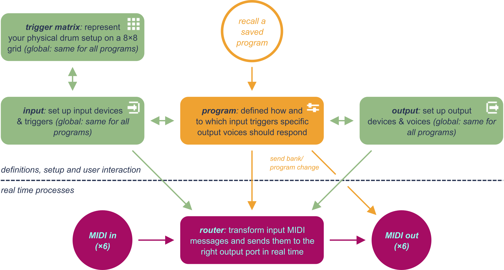

<header>

# Cybo-Drummer

**Humanize those drum computers!**

&copy; 2024&ndash;2025 Harm Lammers
</header>
<main>

# Introduction

I own an electronic drum kit and a bunch of drum computers and my dream was to use the former to play the latter, so I went searching for a way to do just that &ndash; allowing me to easily switch between different configurations combining the sounds of one or more drum computers. I looked for hardware solutions, but couldn&rsquo;t find any. I looked for software solutions, but I could only find MIDI mappers or other complex solutions that would never give me the easy-to-use experience I had it mind. It turns out that (as usual) I go against the current fashion of trying to make an electronic drum kit sound (and look) as acoustic as possible. So I decided to develop my own solution &ndash; and publish it as open source DIY project, hoping it finds like-minded drummers!

> [!NOTE]
> Cybo-Drummer 0.3.0, launched in June 2025, is a total redesign:
>
> * Newly designed hardware, including custom PCBs and a 3D printed case
> * Completely redesigned and simplified workflow, making it much more intuitive to use, yet virtually as powerful
> * Improved performance and in particular a much more responsive user interface (thanks to the Raspberry Pi Pico 2 offering about twice as much RAM as the original Pico)
> * Improved graphic user interface, with a better layout, the introduction of icons and a new font specially designed for Cybo-Drummer
> * One more push button and generally an improved use of the push buttons and encoders, making the interaction with Cybo-Drummer much faster and more intuitive
> * New tools to easily assign note series to toms and scales/modes and chords to multipad triggers
> * Many bug fixes and other improvements
>
> Are you an experienced drummer (I&rsquo;ve only started my drumming journey in April 2023 and too much of my time has gone into developing Cybo-Drummer instead of practizing&hellip;) with a fascination for synthesized drum sounds? I&rsquo;d love to hear how you experience using Cybo-Drummer. What would you change? What features are you missing?
>
> Are you a developer with indepth experience with USB MIDI? I haven&rsquo;t figured out yet how to name different MIDI interfaces combined in one USB connection, so please let me know if you understand how this works (or share your knowledge on the [MicroPython GitHub discussion](https://github.com/orgs/micropython/discussions/16435) on this topic). Your help would be appreciated!
>
> Of course I&rsquo;m open for collaboration. Just let me know how you think you can contribute!
>
> Please use the [issues tab](https://github.com/HLammers/cybo-drummer/issues) to report bug and other issues, or the [discussion tab](https://github.com/HLammers/cybo-drummer/discussions) to discuss anything else.

# Overview

Cybo-Drummer is a MIDI router/mapper with 6 input ports and 6 output ports, specially designed for mapping drum triggers (electronic drum kits&rsquo; modules or brains) to drum computers. Since there is no standard for the MIDI messages sent by drum kits, nor the messages received by drum computers, Cybo-Drummer offers a flexible way of mapping the one to the other.

Cybo-Drummer operates at two distinct levels, each running on its own processor core, as shown by the dashed line in the diagram below:

<!--<figure style="clear:right;margin:10 px auto 20px;max-width:100%;display:table;">  <figcaption style="display:table-caption;caption-side:bottom;">-->
<figure>
  
  <figcaption style="caption-side:bottom;"><small><i>Diagram showing Cybo-Drummer&rsquo;s inner workings. The icons in the corners of the green and orange shapes refer to the respective <a href="USER_MANUAL.md#pages-and-sub-pages">pages</a> in Cybo-Drummer&rsquo;s graphic user interface.</i></small></figcaption>
</figure>

The top level (with the green and orange shapes in the diagram above) manages all definitions, user interaction (buttons and knobs) and the graphic user interface. Some of these definitions are global and the same for all programs (green shapes and arrows), while other definitions (orange shapes and arrows) change when selecting one of the up to 2,600 programs (26 banks of 100 programs).

The bottom level (with the purple shapes and arrows in the diagram above) does its work hidden to the user. Here sits the actual router that routes MIDI data from input ports to output ports &ndash; transformed if neccessary. It is optimized to do as little as possible, to minimize latency.

No interaction takes place between the top and the bottom layer, except if a program is changed or a set-up definition is modified &ndash; this resets the router, rebuilding each route based on the definitions from the top layer.

# Features

## Main Features

* Real-time (low latency) mapping of up to 6 MIDI input devices (drum kits, drum triggers, multipad devices, etc.) to up to 6 MIDI output devices (drum computers, samplers, synthesizers, etc.)
* Combine multiple input devices in a single setup
* Define up to 2,600 programs (26 banks of 100 programs) to easily swich between different output devices and voices
* Combine multiple output devices in one program
* Layer multiple voices from the same or different output devices, including advanced layering techniques based on velocity layers and transition curves
* Set trigger dependency to cc value (a common way for drum modules/brains to distinguish between open and closed hihat)
* Adjust velocity dynamics (threshold, curve, minimum velocity, maximum velocity)
* Adjust how to send note off (off, pulse, fixed delay or a toggle on/off effect)
* Send program change and/or bank select commands to output devices on program change
* Quickly set up toms to the same output device/voice, but with different notes, based on intervals or chords
* Quickly assign notes to the pads of a multipad trigger to differnt notes, based on scales/modes or to chords (or a combination of both)
* Basic MIDI monitor

## Hardware

* 6 MIDI input ports (5-pin DIN)
* 6 MIDI output ports (5-pin DIN)
* 2.2 inch colour display (220×176 pixels)
* 2 knobs (rotary encoders) and 3 buttons to interact with Cybo-Drummer&rsquo;s graphic user interface
* Power over micro USB or 5V DC power supply
* Option to mount onto drum rack using a standard mounting plate with screw holes spaced 70×100mm (as often used for drum modules/brains and multipads)

# Documentation

For indept documentation on Cybo-Drummer, see the following files:

* [User Manual](USER_MANUAL.md)
* [Building Instructions](BUILDING_INSTRUCTIONS.md)
* [Example Presets](EXAMPLE_PRESETS.md)

> [!NOTE]
> **<ins>Cybo-Drummer Terminology</ins>**
>
> Since there is no universal terminology used by all manufacturers of electronic drum equipment and drum computers, or that describes all possible combinations of equipment that could be used, a choice had to be made to use the following terminology for Cybo-Drummer:
>
> <table>
> <tr><td><b><i>Input device</i></b></td><td>A drum kit, drum triggers, multipad device, keyboard or other device which exists of multiple <i>triggers</i> and outputs MIDI data</td></tr>
> <tr><td><b><i>Trigger</i></b></td><td>A drum pad, trigger or similar element of an electronic drum kit or other type of <i>input device</i>; a trigger has one or more <i>zones/layers</i></td></tr>
> <tr><td><b><i>Zone/layer</i></b></td><td>A zone or a layer of a <i>trigger</i> which sends a specific MIDI note</td></tr>
> <tr><td><b><i>Multipad device</i></b></td><td>A specific type of <i>input device</i> which combines typically between 4 and 12 pads (<i>triggers</i>) into a single device, which can be used as a compact, table-top or stand mounted drumkit, or used as extension of a regular drum kit; sometimes also called &lsquo;electronic drum pads&rsquo;, &lsquo;electronic percussion controller&rsquo; or &lsquo;sample pads&lsquo; (if it is sample based) or similar</td></tr>
> <tr><td><b><i>Output device</i></b></td><td>A drum computer, sampler, synthesizer or other device which responds to MIDI data</td></tr>
> <tr><td><b><i>Voice</i></b></td><td>A specific sound of an <i>output device</i> which responds to a specific MIDI channel and/or note(s)</td></tr>
> </table>

# Why Cybo-Drummer is Written in MicroPython

A MIDI router/mapper is a time-sensitive application, so why not using the programming language which leads to the fastest possible code (on a Raspberry Pi that would be C++)? Well&hellip; I do am aware that MicroPython is much slower, but I decided to use it anyway, because besides solving my challenge to connect my electronic drum kit to my drum computers, I had a second goal: finally learning how to use Python. You see, I&rsquo;ve used several programming languages over time (starting with BASIC when I was a child, then Turbo Pascal as a teenager in the 90s, later a bit or C/C++ at university, some JavaScript, a lot of VBA and more recently some Arduino code). But never before I found the time to learn Python, while profesionally I&rsquo;m managing a small product development and innovaiton team, with analysts/developers who are using Python as their go-to language &ndash; so I decided it was time to finally master that language as well. This project was a great learning journey!

I spent a lot of time optimizing the code (for speed and memory usage) and it turns out MicroPython on a Raspberry Pi Pico is fast enough after all. Keep in mind MIDI is a 40+ year old protocol, so it is pretty slow by today&rsquo;s standards &ndash; enough time between two MIDI bytes to run a bit of Python code.

To keep latency to a minimum the second core is dedicated to MIDI handling, while the primary core takes care of the graphic user interface and button and rotary encoder input. In that way the second core runs a light loop doing only time-sensitive MIDI routing, while the primary core does all the heavy stuff.

# Ideas for Features and Improvements to be Added

- [ ] Improved hardware, including proper front panel and 3d printable case
- [ ] Add USB MIDI input/output (USB MIDI support only became available in MicroPython 1.23, which was released at end of May 2024, which is after I developed the MIDI handling side of Cybo-Drummer)
- [ ] Add MIDI clock distribution
- [ ] Add filter options to MIDI monitor
- [ ] Add note off delay setting to trigger pads that need longer time between note on and note off than what is received from the input trigger
- [ ] Add MIDI CC mapping (doing crazy things, for example with the hihat foot pedal or an express pedal)
- [ ] Add velocity mapping (triggering something different when hitting softly or hitting hard)
- [ ] Add option to send MIDI start, stop or continue messages on trigger
- [ ] Rethinking how to deal with choke events, which for some drum modules lead to MIDI note events (2Box, Alesis?) and for others to poly aftertouch/pressure MIDI CC messages (Roland, Yamaha)
- [ ] Add choke groups which could combine different devices
- [ ] Thinking through how the specific possibilities and needs when using Cybo-Drummer with a multi-pad controller (I recently bought and old Roland SPD-11 for that purpose)
- [ ] Building an editor for program and device/trigger/preset definitions and settings files on a pc

# Licencing

Copyright &copy; 2024&ndash;2025 Harm Lammers

This project is free hardware/software: you can redistribute it and/or modify it under the terms of the GNU General Public License as published by the Free Software Foundation, either version 3 of the License, or (at your option) any later version.

This project is distributed in the hope that it will be useful, but WITHOUT ANY WARRANTY; without even the implied warranty of MERCHANTABILITY or FITNESS FOR A PARTICULAR PURPOSE. See the GNU General Public License for more details.

See [LICENSE](./LICENSE) for the full license text.

The fonts used for the logo and the front panel are Soviet Regular and Soviet X-Expanded, &copy; 2003 Dan Zadorozny &ndash; [Iconian Fonts](https://www.iconian.com), published with the following copyright statement:

> This font may be freely distributed and is free for all non-commercial uses.  This font is e-mailware; that is, if you like it, please e-mail the author at:
>
> iconian@aol.com

</main>