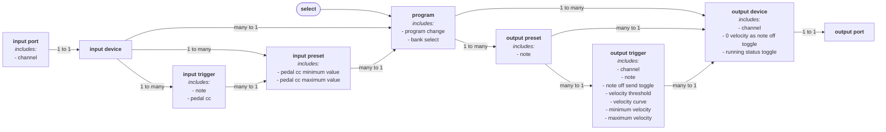

# Cybo-Drummer
**Humenize those drum computers!**

(c) 2024 Harm Lammers
## Introduction
I own an electronic drum kit and a bunch of drum computers and my dream was to use the former to play the latter, so I went searching for a way to do just that - allowing me to easily switch between different configurations combining the sounds of one or more drum computers. I looked for hardware solutions, but couldn’t find any. I looked for software solutions, but I could only find MIDI mappers or other complex solutions that would never give me the easy to use experience I had it mind. It turns out that (as usual) I go against the current fashion of trying to make an electronic drum kit sound (and look) as acoustic as possible. So I decided to develop my own solution - and publish it as open source DIY project, hoping it finds like-minded drummers!
## What Is It?
Cybo-Drummer is a MIDI router/mapper specially designed for mapping drum triggers (electronic drum kits’ brains) to drum computers. Since there is no standard for the MIDI messages sent by drum kits, nor the messages received by drum computers, Cybo-Drummer offers a flexible way of mapping the one to the other.

The idea for the hardware was inspired by the work of [diyelectromusic (Kevin)](https://diyelectromusic.com/), in particular his [Raspberry Pi Pico Multi MIDI Router](https://diyelectromusic.com/2022/09/19/raspberry-pi-pico-multi-midi-router-part-5/). The first prototype is an additional pcb on top of the Multi Midi Router.
### Features
#### Hardware
* 6 5-pin DIN MIDI input ports, allowing to connect up to 6 MIDI devices, of which 1 can be assigned to be a MIDI thru port and 1 to be a MIDI learn port (those could be the same port)
* 6 5-pin DIN MIDI output ports, allowing to connect up to 6 drum computers or other MIDI devices, of which 1 can be assigned to be a MIDI thru port
* micro USB port for power and firmware update (MIDI over USB is not yet implemented; next prototype will include 5.5mm socket for 5V DC power supply)
* 2.2 inch colour display (220x176 pixels)
* 2 rotary encoders and 2 push buttons for input and navigation (plus reset button)
#### Software
* Program up to 255 programs (

* Intuitive user interface split into 5 pages, each with 2 to 4 sub-pages:
* Up to 255 user programmable routing programs
* Unlimited number of input device definitions[^1]
* Unlimited number of output device definitions[^1]
* MIDI monitor
[^1]: Limited by available memory

## How to Build One?
## How to Use It?

> [!TIP]
> Output channel can be set at device level (OUT 2/4) or at trigger level (OUT 3/4). Set the device-level channel setting if all a device’s triggers use the same channel (typically assigned to different notes on the same channel). Set the trigger-level channel setting if each trigger uses a different midi channel. If neither device-level, nor trigger-level channel is set, triggers are sent to channel 10.

> [!TIP]
> Output note values can be set at trigger level (OUT 3/4) and at preset level (OUT 4/4). The trigger-level setting is the default for each preset which maps to that trigger, while if a preset-level note is set, that overrules the note setting for that particular preset. This can be used to play tonally (for those drum computers or other MIDI instruments which support that), for example by assigning the same trigger to multiple toms on the input device, but set different notes to tune them differently. If neither trigger-level nor preset-level note is set, note number 60 (C4, middle C) is used.

## Why in Micropython?
A MIDI router/mapper is a time-sensitive application, so why not using the programming language which leads to the fastest possible code (that would be C++ on a Raspberry Pi Pico)? Well... I do am aware that MicroPython is much slower, but I decided to use it anyway, because besides solving my challenge to connect my electronic drum kit to my drum computers, I had a second goal: finally learning how to use Python. You see, I’ve used several programming languages over time (starting with BASIC when I was a child, then Turbo Pascal as a teenager in the 90s, later a bit or C/C++ at university, some JavaScript, a lot of VBA and more recently some Arduino code. But now, for my job, I’m managing analysts who are using Python as their go-to language, so I decided it was time to finally master that language as well. This project was a great learning journey!

I spent a lot of time optimising the code (for speed and memory usage) and it turns out Micropython on a Raspberry Pi Pico is fast enough after all. Keep in mind MIDI is a 40+ year old protocol, so it is pretty slow by today’s standards - enough time between two MIDI bytes to run a bit of Python code.

To keep latency to a minimum the second core is dedicated to MIDI handling, while the primary core takes care of the graphic user interface and button and rotary encoder input. In that way the second core runs a light loop doing only time-sensitive MIDI routing, while the primary core does all the heavy stuff.
## Known Issues
* Add program doesn’t check if maximun number of programs (255) is reached
## Ideas for Features to be Added
* Add velocity mapping (minimum velocity, maximum velocity, velocity curves)
* Add MIDI clock distribution
* Add MIDI CC mapping (doing crazy things with the hihat foot pedal)
* Add USB MIDI input/output
* Add filter options to MIDI monitor
## Licencing
