<header>

# Cybo-Drummer

**Humanize those drum computers!**

&copy; 2024&ndash;2025 Harm Lammers
</header>
<main>

# User Manual

This file is part of a series of documentation files on Cybo-Drummer:

* [README file](README.md) with brief introduction
* User Manual (this file)
* [Building Instructions](BUILDING_INSTRUCTIONS.md)
* [Example Presets](EXAMPLE_PRESETS.md)

> [!NOTE]
> **<ins>Cybo-Drummer Terminology</ins>**
>
> Since there is no universal terminology used by all manufacturers of electronic drum equipment and drum computers, or that describes all possible combinations of equipment that could be used, a choice had to be made to use the following terminology for Cybo-Drummer:
>
> <table>
> <tr><td><b><i>Input device</i></b></td><td>A drum kit, drum triggers, multipad device, keyboard or other device which exists of multiple <i>triggers</i> and outputs MIDI data</td></tr>
> <tr><td><b><i>Trigger</i></b></td><td>A drum pad, trigger or similar element of an electronic drum kit or other type of <i>input device</i>; a trigger has one or more <i>zones/layers</i></td></tr>
> <tr><td><b><i>Zone/layer</i></b></td><td>A zone or a layer of a <i>trigger</i> which sends a specific MIDI note</td></tr>
> <tr><td><b><i>Multipad device</i></b></td><td>A specific type of <i>input device</i> which combines typically between 4 and 12 pads (<i>triggers</i>) into a single device, which can be used as a compact, table-top or stand mounted drumkit, or used as extension of a regular drum kit; sometimes also called &lsquo;electronic drum pads&rsquo;, &lsquo;electronic percussion controller&rsquo; or &lsquo;sample pads&lsquo; (if it is sample based) or similar</td></tr>
> <tr><td><b><i>Output device</i></b></td><td>A drum computer, sampler, synthesizer or other device which responds to MIDI data</td></tr>
> <tr><td><b><i>Voice</i></b></td><td>A specific sound of an <i>output device</i> which responds to a specific MIDI channel and/or note(s)</td></tr>
> </table>

## Overview

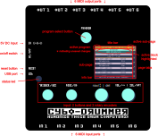

### Connections

Cybo-Drummer has the following physical connections:

* **Near side:**
  * Six 5-pin MIDI input ports to connect input devices
* **Far side:**
  * Six 5-pin MIDI output ports to connect output devices
* **Left side:**
  * Micro USB port &ndash; currently only used for updating the firmware (or as alternative power supply)
  * 5V power supply socket, for a DC adapter using a 5.5×2.1 center positive plug (300mA is certainly enough, 200mA will probably work as well)
 

### Buttons & Knobs

To control Cybo-Drummer&rsquo;s user interface it has three buttons and two rotary encoders on the front panel and a button and a switch on the left side. These have the following functions:

* **PROGRAM**
  * *Press:*
    * *Usually:*&ensp;Open pop-up to [select bank and program](#selecting-a-bank-and-a-program)
    * *If the selected program has unsaved changes:*&ensp;Open [pop-up](#saving-a-program) to select bank and program number to save to
* **TRIGGER/YES:**
  * *Short press:*
    * *Usually:*&ensp;Trigger the selected zone/layer of the selected trigger
    * *In a pop-up:*&ensp;Confirm changes and close pop-up
  * *Long press:*&ensp;Open pop-up to [select trigger and zone/layer](#selecting-a-trigger)
* **PAGE/NO:**
  * *Press:*
    * *Usually:*&ensp;Toggle page select mode on or off
    * *In a pop-up:*&ensp;Cancel changes and close pop-up
* **NAV/&varr; | DEL:**
  * *Turn:*
    * *Usually:*&ensp;Navigate / select active block
    * *In page select mode:*&ensp;Select sub-page (see [Pages and Sub-Pages](#pages-and-sub-pages))
    * *On the [trigger matrix](#trigger-matrix) page or in [text edit pop-up](#text-edit-pop-up):*&ensp;Move selection up or down
  * *Press:*
    * *Usually:*&ensp;Clear selection to blank or default value (if applicable)
    * *In page select mode:*&ensp;Select sub-page (see [Pages and Sub-Pages](#pages-and-sub-pages))
    * *On [program](#program-1) selection or [voice](#voice) name block:*&ensp;Delete program/voice (a [confirmation pop-up](#confirmation-pop-ups) will show)
* **VAL/&harr; | SEL/OPT:**
  * *Turn:*
    * *Usually:*&ensp;Change value of active block
    * *On [trigger matrix](#trigger-matrix) page or in [text edit pop-up](#text-edit-pop-up):*&ensp;Move selection left or right
  * *Short press:*
    * *On changed but not yet confirmed value:*&ensp;Confirm value and process the change (a block turns purple if it has changed but not yet confirmed value)
    * *On [program](#program-1) selection or [voice](#voice) name block:*&ensp;Open options menu pop-up (press twice if the value was changed, but not yet confirmed: the first time will confirm it, the second time triggers rename or options menu)
    * *On button block:*&ensp;Press/execute button
  * *Long press:*
    * *On [trigger matrix](#matrix-cell-1-to-64) page matrix cell:* [**Add all triggers of a multipad device at once**](#adding-all-triggers-of-a-multipad-device-at-once) to the trigger matrix configuration

* **ON/OFF:** *(left side)*
  * Switch Cybo-Drummer on or off when powered with a 5V power supply &ndash; when powered via USB the ON/OFF switch has no effect
* **RESET:** *(left side)*
  * *Press:*&ensp;Resets Cybo-Drummer (has the same effect as turning off and on again)
 

### Display

#### Layout

The user interface displayed on the 2.2-inch TFT screen is organized as follows:

* **Page tabs:**&ensp;The right edge of the screen shows which of the six [pages](#pages-and-sub-pages) is selected
* **Title bar:**&ensp;The top edge of screen shows a title bar, consisting of three elements:
  * On the left the active bank (A to Z) and program number (0 to 99) are always visible (an asterisk is shown behind the number if the program has unsaved changes)
  * Centrally the title of the active sub-page is shown
  * On the right the number of the active sub-page and how many sub-pages the active page has
* **Sub-page:**&ensp;The remainder of the screen is taken by the sub-page itself
  * **Blocks:**&ensp;All sub-pages except monitor pages are structured in blocks which can be selected to enter input; the active block is highlighted using a dark and light sea green colour
  * **Info bar:**&ensp;All sub-pages except monitor pages have an info bar at the bottom, which shows additional information about the selected block

#### Pages and Sub-Pages

Cybo-Drummer&rsquo;s user interface is organized in six pages:

* &emsp;**program & trigger matrix:**&ensp;Select and edit routing programs
* &emsp;**trigger matrix:**&ensp;Assign output triggers to a visual matrix representation
* &emsp;**input:**&ensp;Edit input port assignments, input device setting, input trigger settings and input preset settings
* &emsp;**output:**&ensp;Edit output port assignments, output device setting, output trigger settings and output preset settings
* &emsp;**tools:**&ensp;Quickly assign toms and multipad triggers based on scales, intervals, chords, etc.
* &emsp;**monitor:**&ensp;Show router and MIDI monitors
* &emsp;**settings:**&ensp;Adjust global settings
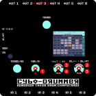

To change pages and sub-pages:
1. press the PAGE button &#9312; to enter page select mode
2. Turn the VAL/&harr; knob &#9313; to change the page or the NAV/&varr; knob &#9314; to change the sub-page
3. Press the PAGE button &#9312;, the DEL knob &#9315; or the SEL/OPT knob &#9316;

While in page select mode the page tabs and title bar are highlighted in dark and light sea green.

> [!IMPORTANT]
> The [program](#program) page () and the [tools](#tools) page () do not save automatically, all other pages do (after confirming a changed value). An asterisk will show behind the active program number if there are unsaved changes. Press the PROGRAM button when there are unsaved changes to [save a program](#saving-a-program).

## Getting Started

The general workflow of using Cybo-Drummer follows its inner workings as shown in the diagram below.

* Start by [organizing input triggers on the trigger matrix](#organizing-input-triggers-on-the-trigger-matrix);
* then [set up input devices](#setting-up-an-input-device) and [assign triggers](#assigning-triggers-to-an-input-device);
* and [set up output devices](#setting-up-an-output-device) and their [voices](#setting-up-an-output-devices-voices).
* Now the global setup is finished it is time to [set up programs](#setting-up-a-program).
* Once programs are defined it is time to use Cybo-Drummer for your drumming sessions by [recalling your desired programs](#selecting-a-bank-and-a-program.)

<figure align="center">
  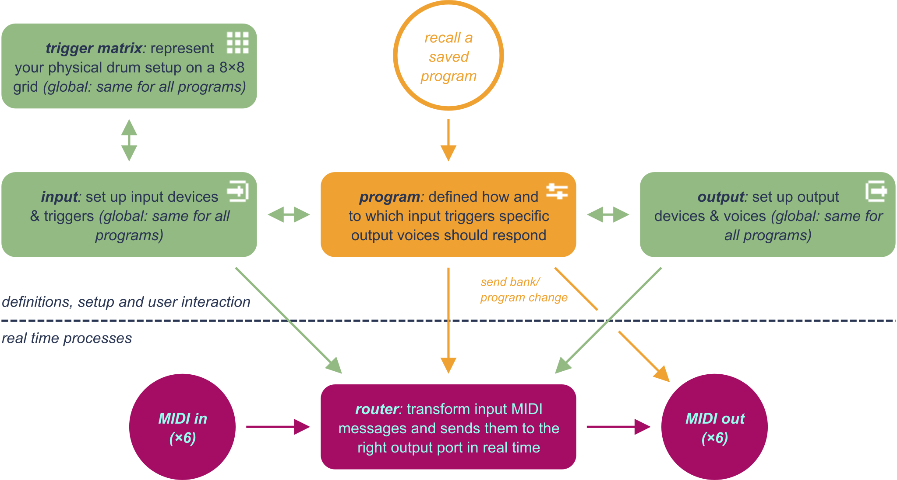
  <figcaption><small><i>Diagram showing Cybo-Drummer&rsquo;s inner workings. Green shapes and arrows represent the global definitions, which are the same no matter which program is selected; orange shapes and arrows represent programs, of which up to 2,600 (26 banks of 100 programs) can be stored and recalled; purple shapes and arrows represent the completely separate layer (running on its own processor core) which does the actual real time routing and transformation. The icons in the corners of the green and orange shapes refer to the respective <a href="#pages-and-sub-pages">pages</a> in Cybo-Drummer&rsquo;s graphic user interface.</i></small></figcaption>
</figure>
 

<figure align="right">
  
  <figcaption><small><i>Example of a trigger matrix setup including a drum kit, a 2×8 multipad and a couple of additional trigger pads</i></small></figcaption>
</figure>

### Organizing Input Triggers on the Trigger Matrix

The very first step to set up Cybo-Drummer is setting up the [trigger matrix](#trigger-matrix) to (roughly) represent your drum setup. Each cell in the matrix can represent a trigger, which can have multiple [zones or layers](#triggers-and-zoneslayers) (for example ride cymbal with an edge, bow, bell and choke zone &ndash; not all of these need to be in use). Make sure to include all triggers you&rsquo;d like to use with Cybo-Drummer, because the same trigger matrix is used to [select a trigger](#selecting-a-trigger), so triggers which are not assigned to the trigger matrix cannot be selected for editing or assignment that way.

> [!NOTE]
> Number your toms from high to low for the [toms assignment tool](#assigning-notes-to-toms) to work properly (so T1 is your highest tom, which is the leftmost tom on a typical right-handed setup).
 

#### Adding a Single Trigger

1. Go to the [trigger matrix](#trigger-matrix) page ()
2. Select the [trigger matrix cell](#matrix-cell-1-to-64) to which you&rsquo;d like to assign a trigger
3. Short press the SEL/OPT knob &#9312; to show a trigger selection pop-up
4. **Assign trigger** is selected by default &ndash; turn the VAL/&harr; knob &#9313; to choose the trigger to assign
5. *Optionally* turn the NAV/&varr; knob &#9314; to select **set active zone/layer** and turn the VAL/&harr; knob &#9313; to select an option (this only affects the active trigger setting, not the stored trigger matrix configuration)
6. Press the SEL/OPT knob &#9312; or the YES button &#9315; to confirm (or press the NO button &#9316; to cancel without changes)

> [!NOTE]
> If you assign a trigger which is already assigned to a different cell, it will be removed from its old position on the trigger matrix, so you&rsquo;re essentially moving it to a new location.
 

#### Adding All Triggers of a Multipad Device at Once

<ol>
<li>Go to the <a href="#trigger-matrix">trigger matrix</a> page ()</li>
<li>Select the <a href="#matrix-cell-1-to-64">trigger matrix cell</a> to which you&rsquo;d like to assign the top-left corner of the multipad</li>
<li>Long press the SEL/OPT knob &#9312; to show a multipad selection pop-up</li>
<li>Turn the VAL/&harr; knob &#9313; to choose the mutlipad layout which best matches your multipad device:<table>
<tr><td><b>Layout Name</b></td><td><b>Layout</b></td><td><b>Examples of Devices</b></td></tr>
<tr><td>4 pads 2x2</td><td><table style="font-size:0.7em;text-align:center;">
<tr><td>3</td><td>4</td></tr>
<tr><td>1</td><td>2</td></tr>
</table></td><td style="font-size:smaller;">Alesis SamplePad 4, KAT KTMP1</td></tr>
<tr><td>6 pads 2x3</td><td><table style="font-size:0.7em;text-align:center;">
<tr><td>4</td><td>5</td><td>6</td></tr>
<tr><td>1</td><td>2</td><td>3</td></tr>
</table></td><td style="font-size:smaller;">Hampback ST-5, Nord Drum 3P</td></tr>
<tr><td>8 pads 2x4</td><td><table style="font-size:0.7em;text-align:center;">
<tr><td>5</td><td>6</td><td>7</td><td>8</td></tr>
<tr><td>1</td><td>2</td><td>3</td><td>4</td></tr>
</table></td><td style="font-size:smaller;">Alesis PerformancePad, Carlsbro OKTA-A, NUX DP-2000, Roland Octapad / SPD-8 / SPD-11 / SPD-20 / SPD-20 PRO / SPD-30</td></tr>
<tr><td>8 pads 2x3+2</td><td><table style="font-size:0.7em;text-align:center;">
<tr><td>7</td><td> </td><td>8</td></tr>
<tr><td>4</td><td>5</td><td>6</td></tr>
<tr><td>1</td><td>2</td><td>3</td></tr>
</table></td><td style="font-size:smaller;">Alesis SamplePad Pro</td></tr>
<tr><td>9 pads 3x3</td><td><table style="font-size:0.7em;text-align:center;">
<tr><td>7</td><td>8</td><td>9</td></tr>
<tr><td>4</td><td>5</td><td>6</td></tr>
<tr><td>1</td><td>2</td><td>3</td></tr>
</table></td><td style="font-size:smaller;">Alesis Strike MultiPad, DDrum NIO, Millenium NonaPad, Roland SPD-S / SPD-SX / SPD-SX PRO</td></tr>
<tr><td>10 pads 2+2x4</td><td><table style="font-size:0.7em;text-align:center;">
<tr><td>7</td><td>8</td><td>9</td><td>10</td></tr>
<tr><td>3</td><td>4</td><td>5</td><td>6</td></tr>
<tr><td>1</td><td> </td><td> </td><td>2</td></tr>
</table></td><td style="font-size:smaller;">Korg MPS-10</td></tr>
<tr><td>12 pads 4x3</td><td><table style="font-size:0.7em;text-align:center;">
<tr><td>10</td><td>11</td><td>12</td></tr>
<tr><td>7</td><td>8</td><td>9</td></tr>
<tr><td>4</td><td>5</td><td>6</td></tr>
<tr><td>1</td><td>2</td><td>3</td></tr>
</table></td><td style="font-size:smaller;">Yamaha DTX-MULTI 12</td></tr>
</table></li>
<li>Press the SEL/OPT knob &#9312; or the YES button  &#9314; to confirm (or press the NO button &#9315; to cancel without changes)</li>
<li>A <a href="#confirmation-pop-ups">confirmation pop-up</a> will show if one of the cells to which you&rsquo;r assigning the multipad triggers is already assigned to another trigger &ndash; press the YES button  &#9314; to confirm or the NO button &#9315; to cancel</li>
</ol>

> [!NOTE]
> Assigning multipad triggers only works if you select a top-left cell which leaves enough space to the right and to the bottom to add all pads.
>
> If one or more of the multipad triggers are already assigned to different cells, they will be removed from their old positions on the trigger matrix.
 

### Setting Up an Input Device

1. Connect the input device to one of the MIDI input ports
2. Go to the [input ports](#12--input-ports) sub-page (1/2) of the [input](#input) page ()
3. [Give the port a recognizable name](#p1-device-name-to-p6-device-name)
4. Set the [MIDI channel](#channel) on which the input device sends note messages (most commonly channel 10 for drums)

> [!TIP]
> Play a trigger/note on the input device when the [MIDI channel](#channel) block is selected to quickly find the right channel and assign it to the port (press the SEL/OPT knob to confirm).
 

### Assigning Triggers to an Input Device

1. Go to the [input notes/pedal cc](#22--input-notespedal-cc) sub-page (2/2) of the [input](#input) page ()
2. Select the [input trigger](#input-trigger) you&rsquo;d like to assign
3. Select the [port/device](#portdevice) you&rsquo;d like to assign it to
4. For each zone/layer you&rsquo;d like to assign:
   1. Select the [note](#note-1-to-n) the input device sends out
   2. *Optionally* select a [pedal CC](#pedal-cc-1-to-n) (continuous controller) number and a [minimum and maximum CC value](#pedal-cc-min-1-to-n--pedal-cc-max-1-to-n) to which the trigger should respond (some electronic drum kits use foot pedal CC &ndash; typically CC number 5 &ndash; to distinguish between open and closed hihat, which both send out the same note)
5. Repeat from step 2 until all triggers are assigned

> [!NOTE]
> An input trigger can be assigned to one input device only.

> [!TIP]
> Play a trigger/note on the input device when a [note](#note-1-to-n) block is selected to quickly find the right note and assign it to the port (press the SEL/OPT knob to confirm). The same can be done with the [pedal cc](#pedal-cc-1-to-n) block.
 

### Setting Up an Output Device

1. Connect the output device to one of the MIDI input ports
2. Go to the [output ports](#13--output-ports) sub-page (1/3) of the [output](#output) page ()
3. [Give the port a recognizable name](#p1-device-name-to-p6-device-name-1)
4. Go to the [output device](#23--output-device) sub-page (2/3) of the [output](#output) page ()
5. *If all the device&rsquo;s voices respond to the same MIDI channel (different note values):* Set the [MIDI channel](#channel) to which the device&rsquo;s voices respond (often channel 10 for drums)
6. *If you&rsquo;re encountering hanging notes:* Try turning off [0 velocity as note off](#0-velocity-as-note-off)
7. *If you&rsquo;re encountering missing notes:* Try disableing [running status](#running-status)
 

### Setting Up an Output Device&rsquo;s Voices

1. Go to the [output voice](#33--output-voice) sub-page (3/3) of the [output](#output) page ()
2. Go to the [voice](#voice) block and either:
   1. *To edit an existing voice:*
      1. Select the voice you would like to edit
      2. Press the SEL/OPT knob and choose &lsquo;rename&rsquo; from the menu to change the name
   2. *To set up a new voice:*
      1. Select &lsquo;[add new]&rsquo;
      2. Press the SEL/OPT knob to give the voice a name
3. *If all the device&rsquo;s voices respond to a different MIDI channel:* Set the [MIDI channel](#channel-1) to which the voice responds
4. *Optionally* set the [note](#note) to which the voice responds &ndash; if not set, you need to [set the note in each program](#note-a-to-d) which uses this voice, otherwise C4 (middle C) is used
5. *Optionally* set [whether and when note off messages are sent](#note-off) &ndash; this can be [overridden in programs](#note-off-a-to-d)
6. *Optionally* set a [velocity threshold](#vel-threshold) and/or a [velocity curve](#velocity-curve)
5. Repeat from step 2 until all voices are ready
 

### Selecting a Bank and a Program

1. Press the PROGRAM button &#9312; to open the program selection pop-up
2. Turn the NAV/&varr; knob &#9313; to switch between program (default) and bank
3. Turn the VAL/&harr; knob &#9314; to select a bank or a program
5. Press the SEL/OPT knob &#9315; or the YES button &#9316; to confirm (or press the NO button &#9317; to cancel)

 

### Setting Up a Program

1. Press the PROGRAM button &ndash; or go to program block on the [program: mapping voices](#program-1) (1/3) or [program: mapping note](#program-2) (2/3) sub-page of the [program](#program) page () &ndash; and either:
   1. *To edit an existing program:* Select the program you would like to edit
   2. *To set up a new program:* Select an empty program (named &lsquo;[empty]&rsquo;)
2. Go to the [program: mapping voices](#13--program-mapping-voices) (1/3) sub-page of the [program](#program) page () and assign output devices and voices to input triggers:
   1. Select the [input trigger](#input-trigger) to which you want to assign an output device and voice
   2. Select the [output port/device](#portdevice--voice-a-to-d) to assign to the trigger
   3. Select a [voice](#portdevice--voice-a-to-d) to assign to the trigger
   4. Go to the [program: mapping note](#23--program-mapping-note) (2/3) sub-page
   5. *Optionally* set the [note](#note-a-to-d) to which the voice responds if you&rsquo;d like to override the [voice&rsquo;s default note setting](#note) and tune the voice to a specific note (if the device&rsquo;s voice supports that)
   6. *Optionally* set [whether and when note off messages are sent](#note-off-a-to-d) &ndash; this overrides the [voice&resquo;s default setting](#note-off)
   7. *Optionally* set [transient curve](#trans-a-to-d), [velocity layer](#lohi-a-to-d) and [velocity scaling](#scale-a-to-d) to create velocity layers or dynamically mix different voices depending on the input velocity
   8. *Optionally* go back to the [program: mapping voices](#13--program-mapping-voices) (1/3) sub-page and repeat from step ii to add multiple device/voice combinations to be triggered at the same time 
3. *Optionally* set [program change](#p1-pc-to-p6-pc) and [bank select](#p1-msb--lsb-to-p6-msb--lsb) messages to be sent to one or more MIDI output ports to choose output devices&rsquo; program for this Cybo-Drummer program
4. [Save the program](#saving-a-program)

#### Assigning Notes to Toms

If you need to assign the same voice to each tom, but tuned differently, the [assign toms](#14--assign-toms) (1/4) sub-page of the [tools](#tools) page () offers a way to quickly do so.

1. Set up at least one tom following the instructions to [set up a program](#setting-up-a-program) (setting a note is not needed)
2. Go to the [assign toms](#14--assign-toms) (1/4) sub-page of the [tools](#tools) page ()
3. Select whether to assign notes to [center or rim](#centerrim)
4. Select [which toms to be included](#tom-1-to-n)
5. Either:
   1. *To assign based on interval:* Select an [interval](#interval) (only which have the same number of notes as the number of included toms can be selected), the [lowest note](#lowest-note) and the [octave](#octave) for the lowest note
   2. *To assign based on chord:* Select a [chord](#chord) (only which have the same number of notes as the number of included toms can be selected), the [lowest note](#lowest-note) and the [octave](#octave) for the lowest note
   3. *To assign a custom series of notes:* [Assign notes to each tom](#tom-1-to-n) separately
6. *Optionally* shift the assigned notes one semitone at a time using the [note up or note down](#note---note-) button, or a full octave using the [octave up or octave down](#oct---oct-) button

> [!NOTE]
> For [interval](#interval) and [chord](#chord) only those options can be selected which have the same number of notes as the number of included toms.
>
> Toms are numbered from high (T1) to low (T*n*), shown on this sub-page as they would be arranged in a typical right-handed setup of a drum kit: from left to right.
>
> The toms assignment tool only runs if [lowest note](#lowest-note) and [octave](#octave) are set and either [interval](#interval) or [chord](#chord), and runs again if one of these is changed.
>
> The parameters set on the [assign toms](#14--assign-toms) (1/4) sub-page ([interval](#interval), [chord](#chord), [lowest note](#lowest-note), [octave](#octave) and [included toms](#tom-1-to-n)) are not stored in the program. These settings are derived from the program&rsquo;s mapping data each time the tools page loads, by looking for the first combination of parameters (for both interval and chord) which fits. Manually changing the notes might or might not give a match.
>
> If more than one tom has output device(s) and voice(s) assigned, Cybo-Drummer will look for the group of toms with the most definitions in common, starting from the lowest tom (highest T number in the trigger matrix), and assume that those are the included toms.

#### Assigning Single Notes to Multipad Triggers

If you need to assign the same voice to multiple pads of a multipad trigger device, the [multipad: select mode](#24--multipad-select-mode) (2/4) and [multipad: assign notes](#34--multipad-assign-notes) (3/4) sub-pages of the [tools](#tools) page () offer a way to quickly do so. This can be used to easily set up multipad devices for pitched percussion or melodic instruments, playing single notes (as described here) or [chords](#assigning-chords-to-multipad-triggers).

1. Set up the trigger layer you want to assign for at least one pad of the multipad following the instructions to [set up a program](#setting-up-a-program) (setting a note is not needed) &ndash; if you want to assign the notes only to one velocity layer, you should set up that velocity layer in the program definition
2. Go to the [multipad: select mode](#24--multipad-select-mode) (2/4) sub-page of the [tools](#tools) page ()
3. Select the [multipad trigger layer](#multipad-layer) (layer A, layer B, layer C or layer D) to the one you would like to assign
4. Either:
   1. *To assign all pads:* Press the [all to note](#all-to-note) button to set all pads to notes
   2. *To assign some of the pads:* For each pad to be included [set its mode](#pad-1-to-n) to &lsquo;note&rsquo;
5. Go to the [multipad: assign notes](#34--multipad-assign-notes) (3/4) sub-page of the [tools](#tools) page ()
6. Select which [velocity layer](#lohi) you&rsquo;d like to assign (select &lsquo;all&rsquo; to not ignore velocity layers)
7. Either:
   1. *To assign based on scale or mode:*
      1. Select assignment [pattern](#pattern) (first up and then left or first left and then right)
      2. Select a [scale or mode](#scalemode), a [key](#key) and an [octave](#octave-1)
      3. *Optionally* select how much the [shift](#shift) the root note (tonic) assignment left/down or right/up
   2. *To assign a custom series of notes:* [Assign notes to each pad](#pad-1-to-n-1) separately

> [!NOTE]
> The multipad note assignment tool only runs if [key](#key) and [octave](#octave-1) and runs again if one of these is changed.
>
> The parameters set on the [multipad: assign notes](#34--multipad-assign-notes) (3/4) sub-page ([scale/mode](#scalemode), [pattern](#pattern), [key](#key), [octave](#octave-1) and [shift](#shift)) are not stored in the program. These settings are derived from the program&rsquo;s mapping data each time the tools page loads, by looking for the first combination of parameters (for both interval and chord) which fits. If the same combination of notes might be interpreted in more than one way, it will take the first one it encounters. Manually changing the notes might or might not give a match.
>
> If more than one pad has output device(s) and voice(s) assigned, Cybo-Drummer will look for the group of pads with at max one note assigned and the most definitions in common, starting from the first pad (bottom left), and assume that those are the included pads.
>
> Setting the [velocity layer (hi/lo)](#lohi) to &lsquo;all&rsquo; affects all program layers, independently to what velocity layer it&rsquo;s set to (all, high, low). If [velocity layer (hi/lo)](#lohi) is set to &lsquo;high&rsquo; or &lsquo;low&rsquo;, only the program layers (A to D &ndash; assigned on [program: mapping voices](#13--program-mapping-voices) and [program: mapping note](#23--program-mapping-note)) assigned to that velocity layer in the identified reference pad will be copied to all other pads, removeing program layers set to the same velocity layer, but not those set to a different one.
 

#### Assigning Chords to Multipad Triggers

If you need to assign the same voice to multiple pads of a multipad trigger device, the [multipad: select mode](#24--multipad-select-mode) (2/4) and [multipad: assign chords](#44--multipad-assign-chords) (4/4) sub-pages of the [tools](#tools) page () offer a way to quickly do so. This can be used to easily set up multipad devices for pitched percussion or melodic instruments, playing single [notes](#assigning-single-notes-to-multipad-triggers) or chords (as described here).

1. Set up the trigger layer you want to assign for at least one pad of the multipad following the instructions to [set up a program](#setting-up-a-program) (setting a note is not needed, but if you need to distinguish between pads assigned to single notes and pads assigned to chords, set at least two identical layers with different notes to make Cybo-Drummer recognize it as a chord)
2. Go to the [multipad: select mode](#24--multipad-select-mode) (2/4) sub-page of the [tools](#tools) page ()
3. Select the [multipad trigger layer](#multipad-layer) (layer A, layer B, layer C or layer D) to the one you would like to assign
4. Either:
   1. *To assign all pads:* Press the [all to chord](#all-to-chord) button to set all pads to notes
   2. *To assign some of the pads:* For each pad to be included [set its mode](#pad-1-to-n) to &lsquo;chord&rsquo;
5. Go to the [multipad: assign chords](#34--multipad-assign-chords) (3/4) sub-page of the [tools](#tools) page ()
6. One by one [assign chords to each pad](#pad-1-to-n-2)
7. *Optionally* shift the assigned chords one semitone at a time using the [note up or note down](#note---note--1) button, or a full octave using the [octave up or octave down](#octave---octave-) button

> [!NOTE]
> Chord definitions (root, octave, chord quality and inversion) are not stored in the program. The type of chord is derived from the notes which are stored each time the tools page loads, by looking for the first combination of settings which fits. If the same combination of notes might be interpreted in more than one way, it will take the first one it encounters.
>
> If more than one pad has output device(s) and voice(s) assigned, Cybo-Drummer will look for the group of pads with more than program layer which are identical except for the assigned note, starting from the first pad (bottom left), and assume that those are the included pads. The chord assignment tool takes program layer A of that pad as source.
 

### Saving a Program

*When the active program has unsaved changes (indicated by an asterisk behind the program number in the top-left corner of the screen):*

1. Press the PROGRAM button &#9312; to open a pop-up to select where you&rsquo;d like to save the program (jump straight to step 5 to just save the active program)
2. Turn the NAV/&varr; knob &#9313; to switch between program (default) and bank
3. Turn the VAL/&harr; knob &#9314; to select a bank or a program
5. Press the SEL/OPT knob &#9315; or the YES button &#9316; to confirm (or press the NO button &#9317; to cancel)
6. You&rsquo;re finished if you&rsquo;re saving an existing program without changing the bank/program combination, otherwise either:
   * *If you&rsquo;re saving a new program or you selected an unused bank/program combination:* A [text edit pop-up](#text-edit-pop-up) will show to give the program a name
   * *If you select an existing program:* [Confirm](#confirmation-pop-ups) that you want to replace it

> [!NOTE]
> If you change the program (via the program block on [program: mapping voices](#13--program-mapping-voices), [program: mapping note](#23--program-mapping-note) or [program: pc/bank select](#33--pcbank-select) or via MIDI) when the active program has unsaved changes, you will be asked if you want to save changes, and if you [confirm](#confirmation-pop-ups) you start the same procedure as described above.
 

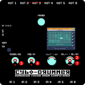

### Selecting a Trigger

1. Long-press the TRIGGER button &#9312; to show a trigger preset selection pop-up
2. Turn the VAL/&harr; knob &#9313; to select an output trigger preset
3. Press the YES button &#9314; to confirm or the NO button &#9315; to cancel

> [!TIP]
> Short-press the TRIGGER button to trigger the last selected output trigger preset (for testing purposes).
 

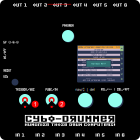

### Confirmation Pop-Ups

Cybo-Drummer doesn&rsquo;t have an undo feature, so to avoid accidentally losing data confirmation pop-ups will show up before deleting something, changing an unsaved program, replacing a program, restoring a back-up or doing a factory reset.

* Press the YES button &#9312; to confirm
* Press the NO button &#9313; to cancel
 

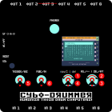

### Text edit pop-up

When renaming a program, device, trigger or setting a text edit pop-up is shown. It shows the text and a selection of characters plus a space bar.

* Turn the NAV/&varr; knob &#9312; to change navigate by row and the VAL/&harr; knob &#9313; to navigate by column and press the SEL/OPT &#9314; knob to add a character
* Press the DEL knob &#9315; to remove the last character (backspace)
* Press the YES button &#9316; to confirm the changes
* Press the NO button &#9317; to cancel renaming
 

## Description of All Pages and Sub-Pages

### &emsp;Program

Use the program page to [edit programs](#setting-up-a-program), which are the part of the mapping routes which change with the [selected program](#selecting-a-bank-and-a-program).

The [program: mapping voices](#13--program-mapping-voices) (1/3) sub-page is the default view when powering up Cybo-Drummer.

 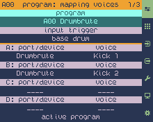

#### &ensp;1/3 &ndash; program: mapping voices

##### program

* Turn the VAL/&harr; knob to **select the active program** (0 to 99) within the active bank ([use the TRIGGER button](#selecting-a-trigger) instead to change the bank), then press the knob to confirm
* Press the SEL/OPT knob &#9312; to show an **options menu**, then turn the VAL/&harr; knob &#9313; to select an option and press the SEL/OPT knob &#9312; or the YES button &#9314; to confirm (or press the NO button &#9315; to cancel) &ndash; menu options:

  * ***rename:*** show a [text edit pop-up](#text-edit-pop-up) to rename the active program
  * ***move backward:*** move the active program one place backward (if not the first program)
  * ***move forward:*** move the active program one place forward (if not the last program)
  * ***move to…:*** move the active program to a specific position &ndash; shows a pop-up to select the bank and program position (turn the NAV/&varr; knob to select bank or program, turn the VAL/&harr; knob to select a number and press the SEL/OPT knob or the YES button to confirm or the NO button to cancel) &ndash; if you select a non-blank program, that program and all subsequent programs until the first blank slot will be shifted one position up (moving will fail if no free spot is left in the selected bank)
* Press the DEL knob to **delete the active program** &ndash; (a [confirmation pop-up](#confirmation-pop-ups) will show)
 
> [!TIP]
> Programs can also be changed from any page/sub-page by [pressing the PROGRAM button](#selecting-a-bank-and-a-program). That is also the way to change the bank.

##### input trigger

* Select the active input trigger to map one up to four output device/voice combinations to (four program layers)

> [!TIP]
> The active input trigger can also be selected by [long-pressing the TRIGGER button](#selecting-a-trigger)
<!--TO DO: double check MIDI learn logic and probably change the way trigger setting works-->
<!--\> If [MIDI learn](#midi-learn) is turned on input device and input preset can also be set to an already mapped device/preset by selecting the respective block and playing the trigger/note on your input device (please note that this is an exception where MIDI learn is not listening to the set MIDI learn port).-->

##### port/device / voice A to D

<small><i>Applies to the active [program](#program-1) and selected [input trigger](#input-trigger)</i></small>

* Turn the VAL/&harr; knob to **map up to 4 output ports/devices and voice combinations** (program layers A, B, C and D) &ndash; these voices will be triggered when the router receives the selected input trigger
* Press the DEL knob on a port/device block to **clear the port/device and voice assignment**

> [!IMPORTANT]
> First select an output port/device, then a voice &ndash; the mapping will only be stored (into the unsaved program) after both a port/device and a voice have been assigned. Changing the output port/device clears the voice selection.
>
> Port/device and program layers A to D change the output mapping for the above selected [input trigger](#input-trigger). To map an input trigger to an output voice, first select the input trigger and then assign the output ports/devices and voices.

> [!TIP]
> Multiple output devices can be combined such that one input trigger triggers multiple output devices&rsquo; voices &ndash; either at the same time, or [dependent on the input trigger velocity](#trans-a-to-d).

 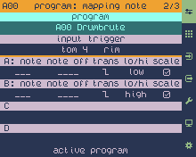

#### &ensp;2/3 &ndash; program: mapping note

##### program

* Turn the VAL/&harr; knob to **select the active program** (0 to 99) within the active bank ([use the TRIGGER button](#selecting-a-trigger) instead to change the bank), then press the knob to confirm
* Press the SEL/OPT knob to show an **options menu**, then turn the VAL/&harr; knob to select an option and press the SEL/OPT knob or the YES button to execute (or press the NO button to leave the options menu) &ndash; see [program](program) on [program: mapping voices](#13--program-mapping-voices) (1/3) sub-page for a description of the menu
* Press the DEL knob to **delete the active program** &ndash; (a [confirmation pop-up](#confirmation-pop-ups) will show)
 
> [!TIP]
> Programs can also be changed from any page/sub-page by [pressing the PROGRAM button](#selecting-a-bank-and-a-program). That is also the way to change the bank.

##### input trigger

* Select the active input trigger to map one up to four output device/voice combinations to (four program layers)

> [!TIP]
> The active input trigger can also be selected by [long-pressing the TRIGGER button](#selecting-a-trigger)
<!--TO DO: double check MIDI learn logic and probably change the way trigger setting works-->
<!--\> If [MIDI learn](#midi-learn) is turned on input device and input preset can also be set to an already mapped device/preset by selecting the respective block and playing the trigger/note on your input device (please note that this is an exception where MIDI learn is not listening to the set MIDI learn port).-->

##### note A to D

<small><i>Applies to the active [program](#program-2) and selected [input trigger](#input-trigger-1)</i></small>

* *Optional*&ensp;Turn the VAL/&harr; knob to **set program layer&rsquo;s note** (C-1 to G9), overriding the device&rsquo;s [voice note setting](#note)
* Press the DEL knob to **clear the note setting** (set to &lsquo;___&rsquo;)
* Clear / set to &lsquo;___&rsquo; to use the [voice&rsquo;s default note](#note)

> [!TIP]
> Output notes can be set here in the program or [in the voice settings](#note). Use the voice note setting to set the default note for that voice (or the only one it responds to, if that&rsquo;s the case). Use the program note settings to override the default and tune the voice to a specific note (if the device&rsquo;s voice supports that) &ndash; different triggers can be assigned to the same voice with a different note.
>
> The [tools](#tools) page () offers a quick way to assign the same voice tuned differently to [toms](#assigning-notes-to-toms) or multipad triggers ([single notes](#assigning-single-notes-to-multipad-triggers), for example to play pitched percussion, or [chords](#assigning-chords-to-multipad-triggers)). C4 (middle C) is used if neither the voice setting, nor the program setting specifies a note.
>
> If a device doesn&rsquo;t respond to the notes your assigned as expected, try one octave lower or one octave higher. There is no official MIDI standard for octave numbers. Cybo-Drummer follows the Scientific Pitch Notation standard, which defines the middle C as C4, so in Cybo-Drummer MIDI note 60 is C4, but some manufacturers define MIDI note as C3 and some as C5.
>
> If [MIDI learn](#midi-learn) is turned on note can also be set by paying a note from a device connected to the set [MIDI learn port](#midi-learn-port).

##### note off A to D

<small><i>Applies to the active [program](#program-2) and selected [input trigger](#input-trigger-1)</i></small>

* *Optional*&ensp;Turn the VAL/&harr; knob to **set whether and when to send note off messages**, overriding the [voice-level note off setting](#note-off):
  * *____:*&ensp;use the [voice&rsquo;s default setting]([#note-off)
  * *off:*&ensp;disable sending note off messages (default)
  * *pulse:*&ensp;send a note off message immediately after sending a note on message
  * *toggle:*&ensp;send a note off message if triggered again (first trigger received sends a note on message, second trigger a note off message)
  * *80 ms* to *1000 ms:*&ensp;send a note off message with a delay of 80 to 1000 milliseconds
* Press the DEL knob to **clear the note off setting** (set to &lsquo;___&rsquo;)
* Clear / set to &lsquo;___&rsquo; to use the [voice&rsquo;s default note off setting](#note-off)

> [!NOTE]
> The MIDI specification prescribes to always send note off messages, however most drum computers ignore them, so it is more efficiently not to send them. Turn on if you experience problems or for example if you&rsquo;re triggering a synth pad instead of a percussive sound.

> [!TIP]
> Note off settings can be set here in the program or [in the voice settings](#note-off). Program note setting overrides voice note off setting.

##### trans A to D

<figure align="right" style="clear:right;margin:10 px 0 px 10px 20px;max-width:100%;display:table;">
  
  <figcaption style="display:table-caption;caption-side:bottom;"><small><i>Four different <a href="#trans-a-to-d">transient curve options</a> and what the relation between <a href="#lohi-a-to-d">the low velocity layer and the high velocity layer</a> looks like if both velocity layers are set to the same curve</i></small></figcaption>
</figure>

<small><i>Applies to the active [program](#program-2) and selected [input trigger](#input-trigger-1)</i></small>

* *Optional*&ensp;Turn the VAL/&harr; knob to **set a transient curve** to make the [low or high end of the input trigger velocity](#lohi-a-to-d) trigger a program layer stronger:
  * *__:*&ensp;off &ndash; the full input velocity is mapped to the output velocity
  * * (hard):*&ensp;hard split the input velocity into two halves and only trigger the selected [velocity layer](#lohi-a-to-d) for half of the input velocity 
  * * (smooth 1):*&ensp;split the input velocity into two halves, but smoothly decrease the amount of triggering the selected [velocity layer](#lohi-a-to-d) in a narrow range in the middle
  * * (smooth 2):*&ensp;split the input velocity into two halves, but smoothly decrease the amount of triggering the selected [velocity layer](#lohi-a-to-d) in a wide range in the middle
  * * (linear):*&ensp;gradually decrease the triggering of the selected [velocity layer](#lohi-a-to-d) over the full trigger velocity range
* Press the DEL knob to **disable the layer&rsquo;s transient curve** (set to &lsquo;__&rsquo;)

> [!TIP]
> Transient curves and [velocity layers](#lohi-a-to-d) can be used to play two different voices with one input trigger, depending on whether you play soft or hard &ndash; this works best with hard transients. It can also be used to create dynamic effects (in many variations) where a voice becomes more prominent or gets mixed in when you play softly or when you play firmly.

##### lo/hi A to D

<small><i>Applies to the active [program](#program-2) and selected [input trigger](#input-trigger-1)</i></small>

* Turn the VAL/&harr; knob to **set to which end of the volocity range a program layer should repond**:
  * *low:*&ensp;respond to the lower end of the input trigger&rsquo;s velocity range (depending on the selected [transient curve](#trans-a-to-d))
  * *high:*&ensp;respond to the higher end of the input trigger&rsquo;s velocity range (depending on the selected [transient curve](#trans-a-to-d))
* This option is not available if a program layer&rsquo;s [transient curve](#trans-a-to-d) is set to &lsquo;__&rsquo; (off)

##### scale A to D

<figure align="right" style="clear:right;margin:10 px 0 px 10px 20px;max-width:100%;display:table;">
  
  <figcaption style="display:table-caption;caption-side:bottom;"><small><i>Illustration of the impact of turning <a href="#scale-a-to-d">scale</a> on or off on the four different <a href="#trans-a-to-d">transient curve options</a> looks like if both <a href="#lohi-a-to-d">velocity layers</a> are set to the same curve (and the voice&rsquo;s <a href="#velocity-curve">velocity curves</a> are set to linear)</i></small></figcaption>
</figure>

<small><i>Applies to the active [program](#program-2) and selected [input trigger](#input-trigger-1)</i></small>

* Turn the VAL/&harr; knob or press the SEL/OPT knob to **switch between scaling () and not scalling () a program layer&rsquo;s output velocity to the full velocity range** (0 to 127)
* Press the DEL knob to **enable scaling ()** (default setting)
* This option is not available if a program layer&rsquo;s [transient curve](#trans-a-to-d) is set to &lsquo;__&rsquo; (off)

 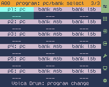

#### &ensp;3/3 &ndash; pc/bank select

##### p1: pc to p6: pc

<small><i>Applies to the active [program](#program-1)</i></small>

* *Optional*&ensp;Turn the VAL/&harr; knob to **set a program change value** (0 to 127), which will be sent to the device assigned to a particular [output port](#p1-device-name-to-p6-device-name-1) on router program change (after sending [bank select](#p1-msb--lsb-to-p6-msb--lsb), if set)
* Press the DEL knob to **clear the program change setting** (set to &lsquo;___&rsquo;)
* Clear / set to &lsquo;___&rsquo; to not send a program change message

> [!NOTE]
> Some MIDI devices number programs 0 to 127, some number them 1 to 128 &ndash; in the latter case you need to set a one position lower program change value on Cybo-Drummer, compared to the output device&rsquo;s number.

##### p1: msb / lsb to p6: msb / lsb

<small><i>Applies to the active [program](#program-1)</i></small>

* *Optional*&ensp;Turn the VAL/&harr; knob to **set most significant byte (msb) bank select value** (0 to 127) and **least significant byte (msb) bank select value** (0 to 127), which will be sent to the device assigned to a particular [output port](#p1-device-name-to-p6-device-name-1) on router program change (before sending [program change](#p1-pc-to-p6-pc), if set)
* Press the DEL knob to **clear bank select msb or lsb setting** (set to &lsquo;___&rsquo;)
* Clear / set to &lsquo;___&rsquo; to not send a bank select msb or lsb message &ndash; it is possible to only send an msb or only an lsb value

> [!NOTE]
> Cybo-Drummer uses raw 0 to 127 MSB and LSB values for bank select, because MIDI devices implement bank select in many different ways, including in cases using only one of the two MIDI CC (continuous controller) messages. Refer to your device&rsquo;s manual and MIDI specifications for details on how to set bank select (and if it is used). If bank select is used to set a single number in the range 0 to 16,383 or 1 to 16,384, that number would typically be calculated as MSB × 128 + LSB or MSB × 128 + LSB + 1.
 

### &emsp;Trigger Matrix

Use the trigger matrix page to [organize input triggers on the trigger matrix](#organizing-input-triggers-on-the-trigger-matrix).

 

#### &ensp;1/4 &ndash; program & trigger matrix

This sub-page shows the active program and allows you to edit the trigger matrix visualizing the [saved input trigger setup](#setting-up-an-input-device) on an 8×8 grid.

> [!NOTE]
> The trigger matrix is a global setting and is not stored and recalled with program (all programs use the same trigger matrix configuration)

##### *Matrix Cell 1 to 64*

* Short press the SEL/OPT knob to show a **[trigger selection pop-up](#organizing-input-triggers-on-the-trigger-matrix)**
* Long press the SEL/OPT knob to [**add all triggers of a multipad device at once**](#adding-all-triggers-of-a-multipad-device-at-once)
* Press DEL knob to **clear the cell&rsquo;s assignment** (a [confirmation pop-up](#confirmation-pop-ups) will show)

> [!NOTE]
> If you assign a trigger which is already assigned to a different cell, it will be removed from its old position on the trigger matrix, so you&rsquo;re essentially moving it to a new location.

<!--TO BE ADDED: Trigger matrix supports MIDI learn (watch out!)-->

 

### &emsp;Input

Use the input page to name input ports to the connected devices and to adjust input device settings.

 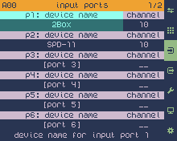

#### &ensp;1/2 &ndash; input ports

##### p1: device name to p6: device name

* Press the SEL/OPT knob to open a [text edit pop-up](#text-edit-pop-up) to **name the input MIDI port** such that it represents the connected device
* Press the DEL knob to clear the port/device name (a [confirmation pop-up](#confirmation-pop-ups) will show)

##### p1: channel to p1: channel

* Turn the VAL/&harr; knob to **set the input port/device&rsquo;s MIDI channel** (1 to 16)
* Press the DEL knob to **clear channel setting** (set to &lsquo;__&rsquo;)

> [!NOTE]
> Cybo-Drummer requires an input channel to be set to work. The port will only listen to MIDI messages on that channel. If no channel is set the port will not respond to any MIDI messages.
>
> Some MIDI devices number MIDI channels 1 to 16, some number them 0 to 15 &ndash; in the latter case you need to set a one position higher channel value on Cybo-Drummer, compared to the input device&rsquo;s number. 

> [!TIP]
> If [MIDI learn](#midi-learn) is turned on channel can also be set by sending anything from that channel from a device connected to the set [MIDI learn port](#midi-learn-port).

 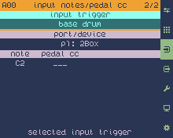

#### &ensp;2/2 &ndash; input notes/pedal cc

##### input trigger

* Turn the VAL/&harr; knob to **select the trigger to edit**
* The trigger can also be selected by long-pressing the TRIGGER button, which opens the [trigger selection pop-up](#selecting-a-trigger)

##### port/device

* Turn the VAL/&harr; knob to **set the input port/device** (p1 to p6) assigned to the selected input trigger

> [!TIP]
> The input port/device can also be set by playing a trigger/note on your input device (this is an exception where MIDI learn is not listening to the set MIDI learn port).

##### note 1 to *n*

<small><i>Applies to the selected [input trigger/zone](#input-trigger-2) &ndash; the number of zones/layers [depends on the input trigger](#triggers-and-zoneslayers)</i></small>

* Turn the VAL/&harr; knob to **select a zone/layer&rsquo;s note** (C-1 to G9)

> [!TIP]
> If a device doesn&rsquo;t respond to the notes your assigned as expected, try one octave lower or one octave higher. There is no official MIDI standard for octave numbers. Cybo-Drummer follows the Scientific Pitch Notation standard, which defines the middle C as C4, so in Cybo-Drummer MIDI note 60 is C4, but some manufacturers define MIDI note as C3 and some as C5.
>
> The note can also be set by playing a trigger/note on your input device (this is an exception where MIDI learn is not listening to the set MIDI learn port).

##### pedal cc 1 to *n*

<small><i>Applies to the selected [input trigger/zone](#input-trigger-2) &ndash; the number of zones/layers [depends on the input trigger](#triggers-and-zoneslayers)</i></small>

* *Optional*&ensp;Turn the VAL/&harr; knob to **set a zone/layer&rsquo;s CC** (continuous controller) **number** (1 to 128) **on which triggering should be [dependent](#pedal-cc-min-1-to-n--pedal-cc-max-1-to-n)**
* Press the DEL knob to **clear pedal CC setting** (set to &lsquo;___&rsquo;)
* Some electronic drum kits use foot pedal CC &ndash; typically CC number 5 &ndash; to distinguish between open and closed hihat, which both send out the same note
* Set pedal CC to &lsquo;__&rsquo; if not relevant for the selected trigger

> [!TIP]
> The pedal CC number can also be set by playing a trigger/note on your input device (this is an exception where MIDI learn is not listening to the set MIDI learn port).

##### pedal cc min 1 to *n* / pedal cc max 1 to *n*

<small><i>Applies to the selected [input trigger/zone](#input-trigger-2) &ndash; the number of zones/layers [depends on the input trigger](#triggers-and-zoneslayers)</i></small>

* *Optional*&ensp;urn the VAL/&harr; knob to **set a minimum and maximum [pedal CC](#pedal-cc)** (continuous controller) **value** (0 to 127) between which to trigger a zone/layer
* Some electronic drum kits use foot pedal CC &ndash; typically CC number 5 &ndash; to distinguish between open and closed hihat, which both send out the same note
* Press the DEL knob to **minimum pedal CC value to 0** (lowest possible value) or **maximum pedal CC value to 127** (highest possible value)

> [!TIP]
> Pedal CC minimum or maximum can also be set by sending CC messages (which CC number doesn&rsquo;t matter) from your input device (this is an exception where MIDI learn is not listening to the set MIDI learn port).
 

### &emsp;Output

Use the output page to name output ports to the connected devices, to adjust output device settings and to define output device&rsquo;s voices.

 

#### &ensp;1/3 &ndash; output ports

##### p1: device name to p6: device name

* Press the SEL/OPT knob to open a [text edit pop-up](#text-edit-pop-up) to **name the output MIDI port** such that it represents the connected device
* Press the DEL knob to clear the port/device name (a [confirmation pop-up](#confirmation-pop-ups) will show)

 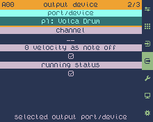

#### &ensp;2/3 &ndash; output device

##### port/device

* Turn the VAL/&harr; knob to **set the output port/device** (p1 to p6) to edit

> [!NOTE]
> Selecting a port/device on this page changes the selected [port/device](#portdevice-2) on the [output voice](#33--output-voice) (3/3) sub-page as well.

<!--TO DO: double check MIDI learn-->

##### channel

<small><i>Applies to the selected [output port/device](#portdevice-1)</i></small>

* *Optional*&ensp;Turn the VAL/&harr; knob to **set the input port/device&rsquo;s MIDI channel** (1 to 16)
* Press the DEL knob to **clear channel setting** (set to &lsquo;__&rsquo;)

> [!IMPORTANT]
> This MIDI channel is used to send control data (program change, bank select), which is not overridden by the [voice-level channel](#channel-1).

> [!TIP]
> Output MIDI channel can be set here at device level or at [voice level](#channel-1). Set the device-level channel setting if all a device&rsquo;s voice use the same MIDI channel (typically assigned to different notes on the same channel). Set the voice-level channel setting if each voice uses a different MIDI channel. Voice-level channel overrides device-level channel. Channel 10 is used if neither device-level nor voice-level channel is set.

##### 0 velocity as note off

<small><i>Applies to the selected [output port/device](#portdevice-1)</i></small>

* Turn the VAL/&harr; knob or press the SEL/OPT knob to **switch between sending note on messages with velocity 0 ()** instead of note off messages **and to force the use of note off messages ()**
* Press the DEL knob to **turn on velociy as note off ()** (default setting)

>[!NOTE]
> 0 velocity as note off requires less MIDI data if combined with [running status](#running-status). To be fully compliant to the MIDI specification a device should recognize note on messages with 0 velocity as note off, so by far most devices do support this &ndash; only turn it off if you experience problems.

##### running status

<small><i>Applies to the selected [output port/device](#portdevice-1)</i></small>

* Turn the VAL/&harr; knob or press the SEL/OPT knob to **switch between enabling running status () and disabling it ()**
* Press the DEL knob to **enable running status ()** (default setting)

>[!NOTE]
> Running status is a way to maximize MIDI data efficiency by leaving out the status byte if consecutive MIDI messages share the same status byte. This leads to even more efficiency if combined with sending [note on messages with 0 velocity instead of note off messages](#0-velocity-as-note-off). To be fully compliant to the MIDI specification a device should recognize running status, so by far most devices do support this &ndash; only turn it off if you experience problems.

 

#### &ensp;3/3 &ndash; output voice

##### port/device

* Turn the VAL/&harr; knob to **set the output port/device** (p1 to p6) to edit

> [!NOTE]
> Selecting a port/device on this page changes the selected [port/device](#portdevice-1) on the [output device](#23--output-device) (2/3) sub-page as well.
<!--TO DO: double check MIDI learn-->
 

##### voice

* Turn the VAL/&harr; knob to **set the output port/device&rsquo;s voice** to edit
* *If an existing voice is selected:* Press the SEL/OPT knob &#9312; to show an **options menu**, then turn the VAL/&harr; knob &#9313; to select an option and press the SEL/OPT knob &#9312; or the YES button &#9314; to execute (or press the NO button &#9315; to leave the options menu) &ndash; menu options:
  * ***rename:*** show a [text edit pop-up](#text-edit-pop-up) to rename the selected voice
  * ***move backward:*** move the selected voice one place backward (if not the first voice)
  * ***move forward:*** move the selected voice one place forward (if not the last voice)
  * ***move to…:*** move the selected voice to a specific position &ndash; shows a pop-up to select the position (turn the VAL/&harr; knob to select a number and press the SEL/OPT knob or the YES button to confirm or the NO button to cancel) all voices after the selected position will be shifted one position up
* *If a new voice (&lsquo;[add new]&rsquo;) is selected:* Press the SEL/OPT knob to show a [text edit pop-up](#text-edit-pop-up) to **rename the selected voice**
* Press the DEL knob to **delete the voice**
* Select &lsquo;[add new]&rsquo; (the value after the last existing voice) to add a new voice

##### channel

<small><i>Applies to the selected [output port/device](#portdevice-2) and [voice](#voice)</i></small>

* *Optional*&ensp;Turn the VAL/&harr; knob to **set the voice&rsquo;s MIDI channel** (1 to 16)
* Press the DEL knob to **clear channel setting** (set to &lsquo;__&rsquo;)

> [!IMPORTANT]
> The [device-level MIDI channel](#channel) is used to send control data (program change, bank select), which is not overridden by this voice-level channel.

> [!TIP]
> Output MIDI channel can be set at [device level](#channel) or here at voice level. Set the device-level channel setting if all a device&rsquo;s voices use the same MIDI channel (typically assigned to different notes on the same channel). Set the voice-level channel setting if each voice uses a different MIDI channel. Trigger-level channel overrides device-level channel. Channel 10 is used if neither device-level nor voice-level channel is set.
> 
> If [MIDI learn](#midi-learn) is turned on channel can also be set by sending anything from that channel from a device connected to the set [MIDI learn port](#midi-learn-port).

##### note

<small><i>Applies to the selected [output port/device](#portdevice-2) and [voice](#voice)</i></small>

* *Optional*&ensp;Turn the VAL/&harr; knob to **set a voice&rsquo;s note** (C-1 to G9)
* Press the DEL knob to **clear the note setting** (set to &lsquo;___&rsquo;)

> [!TIP]
> Output notes can be set [in the program](#note-a-to-d) or here in the voice settings. Use the voice note setting to set the default note for that voice (or the only one it responds to, if that&rsquo;s the case). Use the program note settings to override the default and tune the voice to a specific note (if the device&rsquo;s voice supports that) &ndash; different triggers can be assigned to the same voice with a different note.
>
> The [tools](#tools) page () offers tools to quickly assign the same voice tuned differently to [toms](#assigning-notes-to-toms) or multipad triggers ([single notes](#assigning-single-notes-to-multipad-triggers), for example to play pitched percussion, or [chords](#assigning-chords-to-multipad-triggers)). C4 (middle C) is used if neither the voice setting, nor the program setting specifies a note.
>
> If a device doesn&rsquo;t respond to the notes your assigned as expected, try one octave lower or one octave higher. There is no official MIDI standard for octave numbers. Cybo-Drummer follows the Scientific Pitch Notation standard, which defines the middle C as C4, so in Cybo-Drummer MIDI note 60 is C4, but some manufacturers define MIDI note as C3 and some as C5.
>
> If [MIDI learn](#midi-learn) is turned on note can also be set by paying a note from a device connected to the set [MIDI learn port](#midi-learn-port).

##### note off

<small><i>Applies to the selected [output port/device](#portdevice-2) and [voice](#voice)</i></small>

* *Optional*&ensp;Turn the VAL/&harr; knob to **set whether and when to send note off messages**:
  * *off:*&ensp;disable sending note off messages (default)
  * *pulse:*&ensp;send a note off message immediately after sending a note on message
  * *toggle:*&ensp;send a note off message if triggered again (first trigger received sends a note on message, second trigger a note off message)
  * *80 ms* to *1000 ms:*&ensp;send a note off message with a delay of 80 to 1000 milliseconds
* Press the DEL knob to **set note off to &lsquo;off&rsquo;**

> [!NOTE]
> The MIDI specification prescribes to always send note off messages, however most drum computers ignore them, so it is more efficiently not to send them. Turn on if you experience problems or for example if you&rsquo;re triggering a synth pad instead of a percussive sound.

> [!TIP]
> Note off settings can be set [in the program](#note-off-a-to-d) or here in the voice settings. Program note setting overrides voice note off setting.

##### vel threshold

<figure align="right" style="margin:10 px 0 px 10px 20px;max-width:100%;display:table;">
  
  <figcaption style="display:table-caption;caption-side:bottom;"><small><i>Example of what the velocity curves look like if the threshold is set to 20</i></small></figcaption>
</figure>

<small><i>Applies to the selected [output port/device](#portdevice-2) and [voice](#voice)</i></small>

* Turn the VAL/&harr; knob to **set a velocity level** (0 to 127) **under which trigger input is ignored**
* Press the DEL knob to **set the velocity threshold to 0**
* Set the threshold to 0 for no threshold

> [!NOTE]
> The velocity threshold is independent of the [velocity curve](#velocity-curve) setting: it cuts it off without scaling (see charts above).

> [!TIP]
> Velocity threshold can be used to avoid loud double triggers on a drum computer with just one or two velocity levels when (accidentally) playing soft ghost notes.

##### velocity curve

<figure align="right" style="margin:10 px 0 px 10px 20px;max-width:100%;display:table;">
  
  <figcaption style="display:table-caption;caption-side:bottom;"><small><i>Charts showing each velocity response curve option</i></small></figcaption>
</figure>

<small><i>Applies to the selected [output port/device](#portdevice-2) and [voice](#voice)</i></small>

* Turn the VAL/&harr; knob to **adjust the velocity response dynamics** in three increasingly positive steps (&lsquo;positive 1&rsquo;, &lsquo;positive 2&rsquo;, &lsquo;positive 3&rsquo;), three increasingly negative steps (&lsquo;negative 1&rsquo;, &lsquo;negative 2&rsquo;, &lsquo;negative 3&rsquo;) or select &lsquo;linear&rsquo; (the default) not to change the velocity (velocity out level = velocity in level)
* Press the DEL knob to **set the velocity curve to linear**
* Positive curves make the output velocity louder (like a compressor), negative curves make it weaker

> [!TIP]
> For drum computers with just two velocity levels, you can adjust the threshold between the first and second level by adjusting the curve: a positive curve makes the second level come in earlier (at a lower input velocity), a negative curve makes it come in later (at a higher input velocity).

> [!IMPORTANT]
> MIDI velocity only has a resolution of 127 steps (1 to 127 &ndash; 0 is note off). Adjusting the velocity curve significantly reduces that resolution:
>
> * *positive 1 / negative 1:* from 127 to 95 steps
> * *positive 2 / negative 2:* from 127 to 64 steps
> * *positive 3 / negative 3:* from 127 to 32 steps

##### min velocity / max velocity

<figure align="right" style="margin:10 px 0 px 10px 20px;max-width:100%;display:table;">
  
  <figcaption style="display:table-caption;caption-side:bottom;"><small><i>Example of what the velocity curves look like if min velocity is set to 32 and max velocity to 95</i></small></figcaption>
</figure>

<small><i>Applies to the selected [output port/device](#portdevice-2) and [voice](#voice)</i></small>

* Turn the VAL/&harr; knob to **set a minimum or maximum of the output velocity range** [voice](#voice)
* Turn the VAL/&harr; knob to **adjust the velocity response dynamics** in three increasingly positive steps (&lsquo;positive 1&rsquo;, &lsquo;positive 2&rsquo;, &lsquo;positive 3&rsquo;) and three increasingly negative steps (&lsquo;negative 1&rsquo;, &lsquo;negative 2&rsquo;, &lsquo;negative 3&rsquo;) or select &lsquo;linear&rsquo; (the default) not to change the velocity (velocity out level = velocity in level)
* Press the DEL knob to **set the minimum velocity to 0 or the maximum velocity to 127**
* Minimum velocity sets the lowest value sent out when the input velocity is 0
* Maximum velocity sets the highest value sent out when the maximum velocity is 127

> [!NOTE]
> Minimum and maximum velocity are linked to the [velocity curve](#velocity-curve) setting: the velocity curve is scaled to the output range set by minimum and maximum velocity.

> [!IMPORTANT]
> MIDI velocity only has a resolution of 127 steps (1 to 127 &ndash; 0 is note off). Adjusting the velocity curve significantly reduces that resolution and adjusting minimum and/or maximum velocity reduces it even further.
 

### &emsp;Tools

This page offers tools to quickly set up [toms](#14--assign-toms) or [multipad triggers](#24--multipad-select-mode) to the same output device/voice with different notes or chords (the latter only for multipad).

> [!NOTE]
> These assignment tools only work for voices which support different notes as input (pitched percussion or non-percussive voices).

 

#### &ensp;1/4 &ndash; assign toms

*See [assigning notes to toms](#assigning-notes-to-toms) for more instructions on how to use this tool.*

##### center/rim

* Turn the VAL/&harr; knob to **select toms&rsquo; trigger zone** (center or rim) to assign notes to
* Press the DEL knob to **set the trigger zone to center** (default)

##### interval

<small><i>Applies to the selected [zone](#centerrim) of the [selected toms](#tom-1-to-n)</i></small>

<ul>
<li>Turn the VAL/&harr; knob to <b>select an interval series</b> to use:  
<table>
<tr><td></td><td><b>Interval</b></td><td><b>Semitones</b></td></tr>
<tr><td rowspan=3><i>2 toms</i></td><td>perfect fourth</td><td>(0, 5)</td></tr>
<tr><td>perfect fifth</td><td>(0, 7)</td></tr>
<tr><td>major sixth</td><td>(0, 9)</td></tr>
<tr><td rowspan=3><i>3 toms</i></td><td>major thirds</td><td>(0, 4, 8)</td></tr>
<tr><td>perfect fourths</td><td>(0, 5, 10)</td></tr>
<tr><td>perfect fifths</td><td>(0, 7, 14)</td></tr>
<tr><td rowspan=5><i>4 toms</i></td><td>major thirds</td><td>(0, 4, 8, 12)</td></tr>
<tr><td>P4/P4/M3</td><td>(0, 4, 9, 14)</td></tr>
<tr><td>perfect fourths</td><td>(0, 5, 10, 15)</td></tr>
<tr><td>2x P4</td><td>(0, 5, 12, 17)</td></tr>
<tr><td>P4/P5/P5</td><td>(0, 7, 12, 17)</td></tr>
</table></li>
<li>The option &lsquo;____&rsquo; means that no interval is selected or detected</li>
<li>Notes can be set either based on intervals or based on a <a href="#chord">chord</a></li>
</ul>

> [!NOTE]
> Only those options can be selected which have the same number of notes as the number of [included toms](#tom-1-to-n).

##### chord

<small><i>Applies to the selected [zone](#centerrim) of the [selected toms](#tom-1-to-n)</i></small>

<ul>
<li>Turn the VAL/&harr; knob to <b>select a chord-based series</b> to use:  
<table>
<tr><td></td><td><b>Chord</b></td><td><b>Semitones</b></td></tr>
<tr><td rowspan=10><i>3 toms</i></td><td>diminished</td><td>(0, 3, 6)</td></tr>
<tr><td>minor</td><td>(0, 3, 7)</td></tr>
<tr><td>major </td><td>(0, 4, 7)</td></tr>
<tr><td>major (1st inv)</td><td>(0, 3, 8)</td></tr>
<tr><td>augmented</td><td>(0, 4, 8)</td></tr>
<tr><td>minor (2nd inv)</td><td>(0, 5, 8)</td></tr>
<tr><td>minor (1st inv)</td><td>(0, 4, 9)</td></tr>
<tr><td>major (2nd inv)</td><td>(0, 5, 9)</td></tr>
<tr><td>minor 7 (no 5)</td><td>(0, 3, 10)</td></tr>
<tr><td>major 7 (no 5)</td><td>(0, 4, 11)</td></tr>
<tr><td rowspan=11><i>4 toms</i></td><td>diminished 7</td><td>(0, 3, 6, 9)</td></tr>
<tr><td>minor 6</td><td>(0, 3, 7, 9)</td></tr>
<tr><td>major 6</td><td>(0, 4, 7, 9)</td></tr>
<tr><td>half-dim 7</td><td>(0, 3, 6, 10)</td></tr>
<tr><td>minor 7</td><td>(0, 3, 7, 10)</td></tr>
<tr><td>dominant 7</td><td>(0, 4, 7, 10)</td></tr>
<tr><td>augmented 7</td><td>(0, 4, 8, 10)</td></tr>
<tr><td>major 7</td><td>(0, 4, 7, 11)</td></tr>
<tr><td>minor/major 7</td><td>(0, 3, 7, 11)</td></tr>
<tr><td>minor</td><td>(0, 5, 8, 12)</td></tr>
<tr><td>major </td><td>(0, 5, 9, 12)</td></tr>
</table></li>
<li>The option &lsquo;____&rsquo; means that no chord is selected or detected</li>
<li>Notes can be set either based on <a href="#interval">intervals</a> or based on a chord</li>
</ul>

> [!NOTE]
> Only those options can be selected which have the same number of notes as the number of [included toms](#tom-1-to-n).

##### lowest note

<small><i>Applies to the selected [zone](#centerrim) of the [selected toms](#tom-1-to-n)</i></small>

* Turn the VAL/&harr; knob to **select the lowest note** (C to B) to assign
* Press the DEL knob to **clear the selected note** (set to &lsquo;__&rsquo;)

##### octave

<small><i>Applies to the selected [zone](#centerrim) of the [selected toms](#tom-1-to-n)</i></small>

* Turn the VAL/&harr; knob to **select the octave for the [lowest note](#lowest-note)** (-1 to 9)
* Press the DEL knob to **set the octave to 1** (default)

##### note &#x25B2; / note &#x25BC;

<small><i>Applies to the selected [zone](#centerrim) of the [selected toms](#tom-1-to-n)</i></small>

* Press the SEL/OPT knob to **transpose all notes one semitone up or down**

##### oct &#x25B2; / oct &#x25BC;

<small><i>Applies to the selected [zone](#centerrim) of the [selected toms](#tom-1-to-n)</i></small>

* Press the SEL/OPT knob to **transpose all notes one octave up or down** (12 semitones)

##### tom 1 to *n*

<small><i>Applies to the selected [zone](#centerrim) of the [selected toms](#tom-1-to-n)</i></small>

* Turn the VAL/&harr; knob or press the SEL/OPT knob to **switch between including () or excluding ()** a tom
* Press the DEL knob to **exclude a tom ()**

##### note 1 to *n*

<small><i>Applies to the selected [zone](#centerrim) of the [selected toms](#tom-1-to-n)</i></small>

* Turn the VAL/&harr; knob to **assign a note** (C-1 to G9)
* Press the DEL knob to **clear the selected note** (set to &lsquo;___&rsquo;)

> [!TIP]
> If a device doesn&rsquo;t respond to the notes your assigned as expected, try one octave lower or one octave higher. There is no official MIDI standard for octave numbers. Cybo-Drummer follows the Scientific Pitch Notation standard, which defines the middle C as C4, so in Cybo-Drummer MIDI note 60 is C4, but some manufacturers define MIDI note as C3 and some as C5.
>
> If [MIDI learn](#midi-learn) is turned on the note can also be set by playing a trigger/note from a device connected to the set [MIDI learn port](#midi-learn-port).

 

#### &ensp;2/4 &ndash; multipad: select mode

*See [assigning single notes to multipad triggers](#assigning-single-notes-to-multipad-triggers) and [assigning chords to multipad triggers](#assigning-chords-to-multipad-triggers) for more instructions on how to use this tool.*

##### multipad layer

* Turn the VAL/&harr; knob to **select multipad&rsquo;s trigger layer** (layer A, layer B, layer C or layer D) to assign [notes](#34--multipad-assign-notes) or [chords](#44--multipad-assign-chords) to
* Press the DEL knob to **select trigger layer A** (default)

##### all to note

<small><i>Applies to the selected [multipad layer](#multipad-layer)</i></small>

* Press the SEL/OPT knob to **set all [pads](#pad-1-to-n) to &lsquo;chord&rsquo;**

##### all to chord

<small><i>Applies to the selected [multipad layer](#multipad-layer)</i></small>

* Press the SEL/OPT knob to **set all [pads](#pad-1-to-n) to &lsquo;note&rsquo;**

##### pad 1 to *n*

<small><i>Applies to the selected [multipad layer](#multipad-layer)</i></small>

* Turn the VAL/&harr; knob to **select whether a pad is included in [note assignment](#34--multipad-assign-notes)** (&lsquo;note&rsquo;), **[chord assignment](#44--multipad-assign-chords)** (&lsquo;chord&rsquo;) **or disabled from assignment** (&lsquo;____&rsquo;)
* Press the DEL knob to **exclude a pad** (set to &lsquo;____&rsquo;)

 

#### &ensp;3/4 &ndash; multipad: assign notes

*See [assigning single notes to multipad triggers](#assigning-single-notes-to-multipad-triggers) for more instructions on how to use this tool.*

##### lo/hi

<small><i>Applies to [pads set to &lsquo;note&rsquo;](#pad-1-to-n) for the selected [multipad layer](#multipad-layer)</i></small>

* Turn the VAL/&harr; knob to **choose to which multipad [program layers](#portdevice--voice-a-to-d) to assign notes to based on [velocity layer(s)](#lohi-a-to-d)**:
  * *all:*&ensp;assign notes to all program layers, independently of their velocity layer settings
  * *low:*&ensp;assign notes only to program layers with the velocity layer set to &lsquo;low&rsquo; 
  * *high:*&ensp;assign notes only to program layers with the velocity layer set to &lsquo;high&rsquo;
* Press the DEL knob to **select assignment to all velocity layers** (set to &lsquo;all&rsquo;)

##### scale/mode

<small><i>Applies to [pads set to &lsquo;note&rsquo;](#pad-1-to-n) for the selected [multipad layer](#multipad-layer) and to selected [velocity layers](#lohi)</i></small>

<ul>
<li>Turn the VAL/&harr; knob to <b>select a scale or mode</b> to asign:  
<table>
<tr><td></td><td><b>Scale/Mode</b></td><td><b>Semitones</b></td></tr>
<tr><td rowspan=7><i>5-tone scale</i></td><td>5t pentatonic major</td><td>(0, 2, 4, 7, 8)</td></tr>
<tr><td>5t pentatonic minor</td><td>(0, 3, 5, 7, 10)</td></tr>
<tr><td>5t in</td><td>(0, 1, 5, 7, 8)</td></tr>
<tr><td>5t yo</td><td>(0, 2, 5, 7, 9)</td></tr>
<tr><td>5t hirajoshi</td><td>(0, 4, 6, 7, 11)</td></tr>
<tr><td>5t iwato</td><td>(0, 1, 5, 6, 10)</td></tr>
<tr><td>5t insen</td><td>(0, 1, 5, 7, 10)</td></tr>
<tr><td rowspan=3><i>6-tone scale</i></td><td>6t blues</td><td>(0, 3, 5, 6, 7, 10)</td></tr>
<tr><td>6t augmented</td><td>(0, 3, 4, 7, 8, 11)</td></tr>
<tr><td>6t whole note</td><td>(0, 2, 4, 6, 8, 10)</td></tr>
<tr><td rowspan=16><i>7-tone scale</i></td><td>7t major</td><td>(0, 2, 4, 5, 7, 9, 11)</td></tr>
<tr><td>7t natural minor</td><td>(0, 2, 3, 5, 7, 8, 10)</td></tr>
<tr><td>7t harmonic minor</td><td>(0, 2, 3, 5, 7, 8, 11)</td></tr>
<tr><td>7t asc melodic minor</td><td>(0, 2, 3, 5, 7, 9, 11)</td></tr>
<tr><td>7t harmonic major</td><td>(0, 2, 4, 5, 7, 8, 11)</td></tr>
<tr><td>7t double harmonic</td><td>(0, 1, 4, 5, 7, 8, 11)</td></tr>
<tr><td>7t altered</td><td>(0, 1, 3, 4, 6, 8, 10)</td></tr>
<tr><td>7t hungarian minor</td><td>(0, 2, 3, 6, 7, 8, 11)</td></tr>
<tr><td>7t hungarian major</td><td>(0, 3, 4, 6, 7, 9, 10)</td></tr>
<tr><td>7t locrian major</td><td>(0, 2, 4, 5, 6, 8, 10)</td></tr>
<tr><td>7t ukrainian dorian</td><td>(0, 2, 3, 6, 7, 9, 10)</td></tr>
<tr><td>7t phrygian dominant</td><td>(0, 1, 4, 5, 7, 8, 10)</td></tr>
<tr><td>7t acoustic</td><td>(0, 2, 4, 6, 7, 9, 10)</td></tr>
<tr><td>7t persian</td><td>(0, 1, 4, 5, 6, 8, 11)</td></tr>
<tr><td>7t half diminished</td><td>(0, 2, 3, 5, 6, 8, 10)</td></tr>
<tr><td>7t lydian augmented</td><td>(0, 2, 4, 6, 8, 9, 11)</td></tr>
<tr><td rowspan=7><i>8-tone scale</i></td><td>8t octatonic (I)</td><td>(0, 2, 3, 5, 6, 7, 8, 11)</td></tr>
<tr><td>8t octatonic (II)</td><td>(0, 1, 3, 4, 6, 7, 9, 10)</td></tr>
<tr><td>8t bebop dominant</td><td>(0, 2, 4, 6, 7, 9, 10, 11)</td></tr>
<tr><td>8t bebop major</td><td>(0, 2, 4, 5, 7, 8, 9, 11)</td></tr>
<tr><td>8t bebop mel minor</td><td>(0, 2, 3, 5, 7, 8, 9, 11)</td></tr>
<tr><td>8t bebop harm minor</td><td>(0, 2, 3, 5, 7, 9, 10, 11)</td></tr>
<tr><td>8t 7th flat 5 dim</td><td>(0, 2, 4, 5, 6, 9, 10, 11)</td></tr>
<tr><td><i>9-tone scale</i></td><td>9t melodic minor</td><td>(0, 2, 3, 5, 7, 8, 9, 10, 11)</td></tr>
<tr><td><i>12-tone scale</i></td><td>12t chromatic</td><td>(0, 1, 2, 3, 4, 5, 6, 7, 8, 9, 10, 11)</td></tr>
<tr><td rowspan=8><i>Mode</i></td><td>ionian mode (I)</td><td>(0, 2, 4, 5, 7, 9, 11)</td></tr>
<tr><td>dorian mode (II)</td><td>(0, 2, 3, 5, 7, 9, 10)</td></tr>
<tr><td>phrygian mode (III)</td><td>(0, 1, 3, 5, 7, 8, 10)</td></tr>
<tr><td>lydian mode (IV)</td><td>(0, 2, 4, 6, 7, 9, 11)</td></tr>
<tr><td>mixolydian mode (V)</td><td>(0, 2, 4, 5, 7, 9, 10)</td></tr>
<tr><td>aeolian mode (VI)</td><td>(0, 2, 3, 5, 7, 8, 10)</td></tr>
<tr><td>locrian mode (VII)</td><td>(0, 1, 3, 5, 6, 8, 10)</td></tr>
<tr><td>flamenco mode</td><td>(0, 1, 4, 5, 7, 8, 11)</td></tr>
</table></li>
<li>The option &lsquo;____&rsquo; means that no scale or mode is selected or detected</li>
<li>Press the DEL knob to <b>select the major scale</b>** (default)</li>
</ul>

##### pattern

<small><i>Applies to [pads set to &lsquo;note&rsquo;](#pad-1-to-n) for the selected [multipad layer](#multipad-layer) and to selected [velocity layers](#lohi)</i></small>

* Turn the VAL/&harr; knob to **set the direction in which notes are assigned**:
  * *__:*&ensp;off &ndash; no assignment pattern selected or detected
  * *:*&ensp;assign notes first up and then right 
  * *:*&ensp;assign notes first right and then up

##### key

<small><i>Applies to [pads set to &lsquo;note&rsquo;](#pad-1-to-n) for the selected [multipad layer](#multipad-layer) and to selected [velocity layers](#lohi)</i></small>

* Turn the VAL/&harr; knob to **select the key** (C to B) for the [scale or mode](#scalemode)
* Press the DEL knob to **clear the selected note** (set to &lsquo;__&rsquo;)

##### octave

<small><i>Applies to [pads set to &lsquo;note&rsquo;](#pad-1-to-n) for the selected [multipad layer](#multipad-layer) and to selected [velocity layers](#lohi)</i></small>

* Turn the VAL/&harr; knob to **select the octave for the [key](#key)** (-1 to 9)
* Press the DEL knob to **set the octave to 1** (default)

##### shift

<small><i>Applies to [pads set to &lsquo;note&rsquo;](#pad-1-to-n) for the selected [multipad layer](#multipad-layer) and to selected [velocity layers](#lohi)</i></small>

* Turn the VAL/&harr; knob to **shift the root note (tonic) position left/down** (negative number) **or right/up** (positive number)
* Press the DEL knob to **set shift to 0** (no shift &ndash; the root note (tonic) is the first included pad counting from the bottom left following the selected [pattern](#pattern))
* The minimum and maximum value which can be selected depends on the number of tones in the selected [scale/mode](#scalemode)

##### pad 1 to *n*

<small><i>Applies to [pads set to &lsquo;note&rsquo;](#pad-1-to-n) for the selected [multipad layer](#multipad-layer) and to selected [velocity layers](#lohi)</i></small>

* Turn the VAL/&harr; knob to **assign a note** (C-1 to G9)
* Press the DEL knob to **clear the selected note** (set to &lsquo;___&rsquo;)

> [!TIP]
> If a device doesn&rsquo;t respond to the notes your assigned as expected, try one octave lower or one octave higher. There is no official MIDI standard for octave numbers. Cybo-Drummer follows the Scientific Pitch Notation standard, which defines the middle C as C4, so in Cybo-Drummer MIDI note 60 is C4, but some manufacturers define MIDI note as C3 and some as C5.
>
> If [MIDI learn](#midi-learn) is turned on the note can also be set by playing a trigger/note from a device connected to the set [MIDI learn port](#midi-learn-port).

 

#### &ensp;4/4 &ndash; multipad: assign chords

*See [assigning chords to multipad triggers](#assigning-chords-to-multipad-triggers) for more instructions on how to use this tool.*

##### note &#x25B2; / note &#x25BC;

<small><i>Applies to [pads set to &lsquo;chord&rsquo;](#pad-1-to-n) for the selected [multipad layer](#multipad-layer)</i></small>

* Press the SEL/OPT knob to **transpose all chords one semitone up or down** for the selected [layer]("#multipad-layer") of the [selected multipad triggers](#pad-1-to-n)

##### octave &#x25B2; / octave &#x25BC;

<small><i>Applies to [pads set to &lsquo;chord&rsquo;](#pad-1-to-n) for the selected [multipad layer](#multipad-layer)</i></small>

* Press the SEL/OPT knob to **transpose all chords one octave up or down** (12 semitones) for the selected [layer]("#multipad-layer") of the [selected multipad triggers](#pad-1-to-n)
 

##### pad 1 to *n*

<small><i>Applies to [pads set to &lsquo;chord&rsquo;](#pad-1-to-n) for the selected [multipad layer](#multipad-layer)</i></small>

<ul>
<li>Press the SEL/OPT knob &#9312; to <b>open a chord selection pop-up</b></li>
<li>In the chord selection pop-up:<ul>
  <li>Turn the NAV/&varr; knob &#9313; to switch between &lsquo;root&rsquo;, &lsquo;octave&rsquo;, &lsquo;chord quality&rsquo; and &lsquo;inversion&rsquo;</li>
  <li>Turn the VAL/&harr; knob &#9314; to select a value:<ul>
    <li><i>root:</i>&ensp;select the chord&rsquo;s root note (C to B)</li>
    <li><i>octave:</i>&ensp;select the chord&rsquo;s root note&rsquo;s octave (-1 to 9)</li>
    <li><i>chord quality:</i>&ensp;select one of the following types of chord:<table>
    <tr><td><b>Long Notation</b></td><td><b>Short Notation</b></td><td><b>Semitones</b></td></tr>
    <tr><td>major</td><td></td><td>(0, 4, 7)</td></tr>
    <tr><td>minor</td><td>m</td><td>(0, 3, 7)</td></tr>
    <tr><td>fifth ('power chord')</td><td>5</td><td>(0, 7)</td></tr>
    <tr><td>dominant seventh</td><td>7</td><td>(0, 4, 7, 10)</td></tr>
    <tr><td>major seventh</td><td>M7</td><td>(0, 4, 7, 11)</td></tr>
    <tr><td>minor seventh</td><td>m7</td><td>(0, 3, 7, 10)</td></tr>
    <tr><td>minor major seventh</td><td>nM7</td><td>(0, 3, 7, 11)</td></tr>
    <tr><td>suspended fourth</td><td>sus</td><td>(0, 5, 7)</td></tr>
    <tr><td>suspended second</td><td>sus2</td><td>(0, 2, 7)</td></tr>
    <tr><td>dominant 7th susp. 4th</td><td>7sus</td><td>(0, 5, 7, 10)</td></tr>
    <tr><td>dominant 7th susp. 2nd</td><td>7s2</td><td>(0, 2, 7, 10)</td></tr>
    <tr><td>major added-second</td><td>add2</td><td>(0, 2, 4, 7)</td></tr>
    <tr><td>major added-ninth</td><td>add9</td><td>(0, 4, 7, 14)</td></tr>
    <tr><td>major added-fourth</td><td>add4</td><td>(0, 4, 5, 7)</td></tr>
    <tr><td>major added-eleventh</td><td>a11</td><td>(0, 4, 7, 17)</td></tr>
    <tr><td>minor added-second</td><td>ma2</td><td>(0, 3, 4, 7)</td></tr>
    <tr><td>minor added-ninth</td><td>ma9</td><td>(0, 3, 7, 14)</td></tr>
    <tr><td>minor added-fourth</td><td>ma4</td><td>(0, 3, 5, 7)</td></tr>
    <tr><td>minor added-eleventh</td><td>ma11</td><td>(0, 3, 7, 17)</td></tr>
    <tr><td>suspended 4th added-2nd</td><td>s4a9</td><td>(0, 2, 5, 7)</td></tr>
    <tr><td>suspended 4th added-9th</td><td>s4a9</td><td>(0, 5, 7, 14)</td></tr>
    <tr><td>major sixth</td><td>6</td><td>(0, 4, 7, 9)</td></tr>
    <tr><td>minor sixth</td><td>m6</td><td>(0, 3, 7, 9)</td></tr>
    <tr><td>diminished</td><td>dim</td><td>(0, 3, 6)</td></tr>
    <tr><td>deminished seventh</td><td>dim7</td><td>(0, 3, 6, 9)</td></tr>
    <tr><td>augmented</td><td>aug</td><td>(0, 4, 8)</td></tr>
    <tr><td>dominant 7th flat 5</td><td>7b5</td><td>(0, 4, 6, 10)</td></tr>
    <tr><td>7th sharp 5 / augmented 7th</td><td>7#5</td><td>(0, 4, 8, 10)</td></tr>
    <tr><td>minor 7 flat 5/half dim 7th</td><td>m7b5</td><td>(0, 3, 6, 10)</td></tr>
    <tr><td>major 7th sharp 5</td><td>M7#5</td><td>(0, 4, 8, 11)</td></tr>
    <tr><td>minor 7th sharp 5</td><td>m7#5</td><td>(0, 3, 8, 10)</td></tr>
    </table></li>
    <li><i>inversion:</i>&ensp;select which <a href="https://en.wikipedia.org/wiki/Inversion_(music)#Root_position_and_inverted_chords">inversion</a> of the chord (&rsquo;root position&rsquo; is the default form of the chord, without inversion, with the root noot as the lowest note in the chord &ndash; the number of inversions depends on the number of notes in the chord)</li></ul></li>
  <li>Press the SEL/OPT knob &#9312; or the YES button &#9315; to confirm (or press the NO button &#9316; to cancel without changes)</li></ul></li>
  <li>A chord will only be assigned if a root, octave and chord quality all have been selected
  <li>The pad selection block will show the assigned chord in a short format existing of root note, short chord quality notation (see table above) and octave between brackets &ndash; for example: &lsquo;CM7[4]&rsquo; means a C major seventh chord with the root in the 4th octave
</ul>
 

### &emsp;Monitor

Use the monitor page to monitor the router, MIDI data coming in or MIDI data going out.

 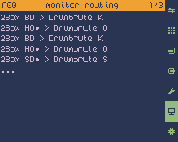

#### &ensp;1/3 &ndash; monitor routing

* Shows what is going on in the router
* Display format: &lsquo;Input Device Trigger/Zone > Output Device Voice&rsquo; (for example: `2Box BD > Drumbrute Kick 1`)

> [!NOTE]
> If an input preset triggers more than one output presets the router will show as many lines as output presets are triggers.

 

#### &ensp;2/3 &ndash; monitor MIDI in

* Shows the MIDI data coming in from any of the MIDI input ports
* Display format: &lsquo;P0 C00 MessageName data [HH HH HH]&rsquo;, where
  * *P0* is the input port (P1 to P6)
  * *C00* is the input channel (C 1 to C16) &ndash; not shown for system common messages
  * *MessageData* is the name of the MIDI message (for example &lsquo;NoteOn&rsquo;)
  * *data* is one or two data values (for example for note on or note off: note and velocity)
  * *[HH HH HH]* is the raw MIDI message in hexadecimal format

> [!NOTE]
> SysEx (system exclusive) data is filtered out by the router and won&rsquo;t show, MIDI clock data and active sensing are filtered out by the monitor and won&rsquo;t show either.

 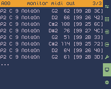

#### &ensp;3/3 &ndash; monitor MIDI out

* Shows the MIDI data sent out to any of the MIDI input ports
* Display format: &lsquo;P0 C00 MessageName data [HH HH HH]&rsquo;, where
  * *P0* is the output port (P1 to P6)
  * *C00* is the output channel (C 1 to C16) &ndash; not shown for system common messages
  * *MessageData* is the name of the MIDI message (for example &lsquo;NoteOn&rsquo;)
  * *data* is one or two data values (for example for note on or note off: note and velocity)
  * *[HH HH HH]* is the raw MIDI message in hexadecimal format

> [!NOTE]
> MIDI clock data and active sensing are filtered out by the monitor and won&rsquo;t show.
 

### &emsp;Settings

Use the settings page to adjust global settings, to back up or recover data or to find the firmware version number.

 

#### &ensp;1/1 &ndash; settings

##### midi thru

* Turn the VAL/&harr; knob or press the SEL/OPT knob to **switch between MIDI thru on ()** to enable MIDI thru from the set input port/channel to the set output port/channel, **and off ()** to disable MIDI thru
* Press the DEL knob to **turn MIDI thru off ()**

> [!NOTE]
> MIDI thru needs input port, input channel, output port and output channel to be specified to work.
>
> SysEx (system exclusive) data is filtered out by the router and will not be sent to the MIDI thru output port.

##### in port / channel

* Turn the VAL/&harr; knob to **select an input port** (1 to 6) **/ input MIDI channel** (1 to 16) to receive MIDI data from to be sent to the MIDI thru output port
* Press the DEL knob to **clear port / channel setting** (set to &lsquo;__&rsquo;)

> [!NOTE]
> Some MIDI devices number MIDI channels 1 to 16, some number them 0 to 15 &ndash; in the latter case you need to set a one position higher channel value on Cybo-Drummer, compared to the input device&rsquo;s number. 

##### out port / channel

* Turn the VAL/&harr; knob to **select an output port** (1 to 6) **/ output MIDI channel** (1 to 16) to send MIDI data to which is received from the MIDI thru output port
* Press the DEL knob to **clear port / channel setting** (set to &lsquo;__&rsquo;)

> [!NOTE]
> Some MIDI devices number MIDI channels 1 to 16, some number them 0 to 15 &ndash; in the latter case you need to set a one position higher channel value on Cybo-Drummer, compared to the output device&rsquo;s number. 

##### midi learn

* Turn the VAL/&harr; knob or press the SEL/OPT knob to **switch between MIDI learn on () and off ()**
* Press the DEL knob to **turn MIDI learn off ()**

> [!NOTE]
> MIDI learn needs midi learn port to be specified to work.

> [!TIP]
> Connect the MIDI out of a drum computer to MIDI learn port and press the trigger button on it for each sound to easily assign drum triggers.

##### midi learn port

* Set from which input port (1 to 6) to receive MIDI data to be used for MIDI learn

* Turn the VAL/&harr; knob to **select an input port** (1 to 6) to receive MIDI data from to be used for MIDI learn
* Press the DEL knob to **clear port setting** (set to &lsquo;__&rsquo;)

##### default output velocity

* Turn the VAL/&harr; knob to **set the default velocity** (0 to 127) used when pressing the TRIGGER button
* Press the DEL knob to **set the default output velocity to 64**

##### store back-up

* Press the SEL/OPT knob to **store all programs, device/trigger/voice definitions and settings to back-up files**
* Device/trigger/voice definitions and settings from `data_files/data.json` are copied to `data_files/back_up.json` and program files from the `data_files/programs/` folder are copied to `data_files/programs_bak/`

##### restore back-up

* Press the SEL/OPT knob to **restore all programs, device/trigger/voice definitions and settings from previously stored back-up files** (if any)
* See [store back-up](#store-back-up) for details on where back-up files are stored

##### factory reset

* Press the SEL/OPT knob to **restore all programs, device/trigger/voice definitions and settings to initial values**
* Initial values consist of default settings and empty lists of programs, devices, triggers and voices

##### about

* Press the SEL/OPT knob to **show what version of Cybo-Drummer you&rsquo;re using**
 

## Triggers and Zones/Layers

<table>
<tr><td colspan=2><b>Trigger</b></td><td colspan=2><b>Zones/Layers</b></td></tr>
<tr><td><b>Symbol</b></td><td><b>Name</b></td><td colspan=2><b>Name (Symbol)</b></td></tr>
<tr><td>BD</td><td>base drum</td><td rowspan=2>n/a</td></tr>
<tr><td>B2</td><td>base drum 2</td></tr>
<tr><td>SD</td><td>snare drum</td><td>center (), rim ()</td></tr>
<tr><td>T1</td><td>tom 1</td><td rowspan=9>center (), rim ()</td></tr>
<tr><td>T2</td><td>tom 2</td></tr>
<tr><td>T3</td><td>tom 3</td></tr>
<tr><td>T4</td><td>tom 4</td></tr>
<tr><td>T5</td><td>tom 5</td></tr>
<tr><td>T6</td><td>tom 6</td></tr>
<tr><td>T7</td><td>tom 7</td></tr>
<tr><td>T8</td><td>tom 8</td></tr>
<tr><td>T9</td><td>tom 9</td></tr>
<tr><td>P1</td><td>percussion 1</td><td rowspan=9>center (), rim ()</td></tr>
<tr><td>P2</td><td>percussion 2</td></tr>
<tr><td>P3</td><td>percussion 3</td></tr>
<tr><td>P4</td><td>percussion 4</td></tr>
<tr><td>P5</td><td>percussion 5</td></tr>
<tr><td>P6</td><td>percussion 6</td></tr>
<tr><td>P7</td><td>percussion 7</td></tr>
<tr><td>P8</td><td>percussion 8</td></tr>
<tr><td>P9</td><td>percussion 9</td></tr>
<tr><td>HO</td><td>open hihat</td><td rowspan=3>edge (), bow (), foot ()</td></tr>
<tr><td>HH</td><td>half-open hihat</td></tr>
<tr><td>HC</td><td>closed hihat</td></tr>
<tr><td>RD</td><td>ride cymbal</td><td>edge (), bow (), bell (), choke ()</td></tr>
<tr><td>C1</td><td>crash/cymbal 1</td><td rowspan=9>edge (), bow (), bell (), choke ()</td></tr>
<tr><td>C2</td><td>crash/cymbal 2</td></tr>
<tr><td>C3</td><td>crash/cymbal 3</td></tr>
<tr><td>C4</td><td>crash/cymbal 4</td></tr>
<tr><td>C5</td><td>crash/cymbal 5</td></tr>
<tr><td>C6</td><td>crash/cymbal 6</td></tr>
<tr><td>C7</td><td>crash/cymbal 7</td></tr>
<tr><td>C8</td><td>crash/cymbal 8</td></tr>
<tr><td>C9</td><td>crash/cymbal 9</td></tr>
<tr><td>M1</td><td>multipad 1</td><td rowspan=12>layer A (), layer B (), layer C (), layer D ()</td></tr>
<tr><td>M2</td><td>multipad 2</td></tr>
<tr><td>M3</td><td>multipad 3</td></tr>
<tr><td>M4</td><td>multipad 4</td></tr>
<tr><td>M5</td><td>multipad 5</td></tr>
<tr><td>M6</td><td>multipad 6</td></tr>
<tr><td>M7</td><td>multipad 7</td></tr>
<tr><td>M8</td><td>multipad 8</td></tr>
<tr><td>M9</td><td>multipad 9</td></tr>
<tr><td>MA</td><td>multipad 10</td></tr>
<tr><td>MB</td><td>multipad 11</td></tr>
<tr><td>MC</td><td>multipad 12</td></tr>
<tr><td>A1</td><td>additional trig. 1</td><td rowspan=9>center (), rim ()</td></tr>
<tr><td>A2</td><td>additional trig. 2</td></tr>
<tr><td>A3</td><td>additional trig. 3</td></tr>
<tr><td>A4</td><td>additional trig. 4</td></tr>
<tr><td>A5</td><td>additional trig. 5</td></tr>
<tr><td>A6</td><td>additional trig. 6</td></tr>
<tr><td>A7</td><td>additional trig. 7</td></tr>
<tr><td>A8</td><td>additional trig. 8</td></tr>
<tr><td>A9</td><td>additional trig. 9</td></tr>
</table>

</main>