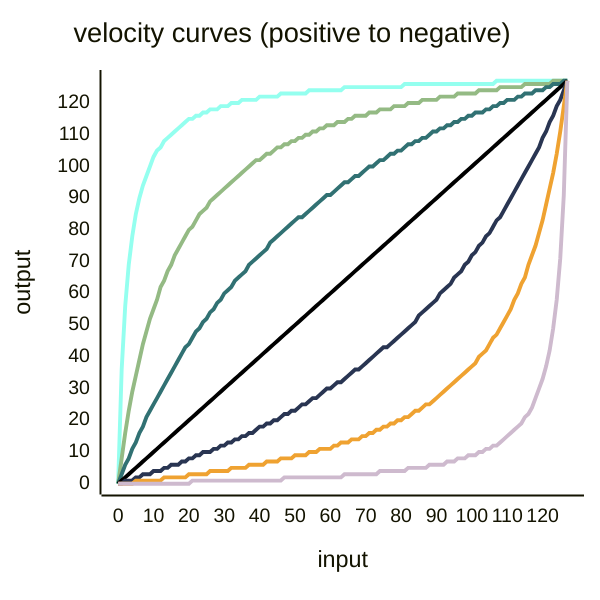
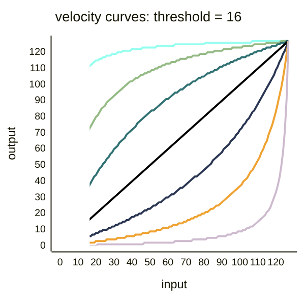
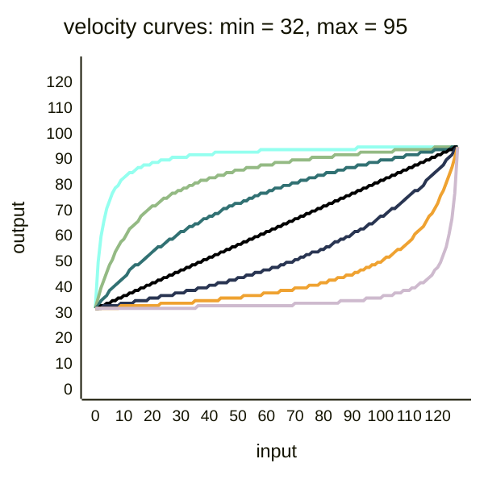

```mermaid
---
config:
    xyChart:
        width: 300
        height: 300
        titleFontSize: 14
        xAxis:
            showTick: false
            axisLineWidth: 1
            titleFontSize: 12
            labelFontSize: 10
        yAxis:
            showTick: false
            axisLineWidth: 1
            titleFontSize: 12
            labelFontSize: 10
    themeVariables:
        xyChart:
            plotColorPalette: "#94ffef, #94ba84, #317173, #000000, #293552, #efa231, #cebace"
---
xychart-beta
title "velocity curves (positive to negative)"
x-axis input 0 --> 127
y-axis output
line "positive 3" [0, 36, 56, 69, 78, 85, 90, 94, 97, 100, 103, 105, 106, 108, 109, 110, 111, 112, 113, 114, 115, 115, 116, 116, 117, 117, 118, 118, 118, 119, 119, 119, 120, 120, 120, 121, 121, 121, 121, 121, 122, 122, 122, 122, 122, 122, 123, 123, 123, 123, 123, 123, 123, 123, 124, 124, 124, 124, 124, 124, 124, 124, 124, 124, 125, 125, 125, 125, 125, 125, 125, 125, 125, 125, 125, 125, 125, 125, 125, 125, 125, 126, 126, 126, 126, 126, 126, 126, 126, 126, 126, 126, 126, 126, 126, 126, 126, 126, 126, 126, 126, 126, 126, 126, 126, 126, 126, 127, 127, 127, 127, 127, 127, 127, 127, 127, 127, 127, 127, 127, 127, 127, 127, 127, 127, 127, 127, 127]
line "positive 2" [0, 8, 16, 23, 29, 34, 39, 44, 48, 52, 55, 58, 62, 64, 67, 69, 72, 74, 76, 78, 80, 81, 83, 85, 86, 87, 89, 90, 91, 92, 93, 94, 95, 96, 97, 98, 99, 100, 101, 102, 102, 103, 104, 104, 105, 106, 106, 107, 107, 108, 108, 109, 109, 110, 110, 111, 111, 112, 112, 113, 113, 113, 114, 114, 114, 115, 115, 116, 116, 116, 116, 117, 117, 117, 118, 118, 118, 118, 119, 119, 119, 119, 120, 120, 120, 120, 121, 121, 121, 121, 121, 122, 122, 122, 122, 122, 123, 123, 123, 123, 123, 123, 124, 124, 124, 124, 124, 124, 125, 125, 125, 125, 125, 125, 125, 126, 126, 126, 126, 126, 126, 126, 126, 127, 127, 127, 127, 127]
line "positive 1" [0, 3, 6, 8, 11, 13, 16, 18, 21, 23, 25, 27, 29, 31, 33, 35, 37, 39, 41, 43, 44, 46, 48, 49, 51, 52, 54, 55, 57, 58, 60, 61, 62, 64, 65, 66, 67, 69, 70, 71, 72, 73, 74, 76, 77, 78, 79, 80, 81, 82, 83, 84, 84, 85, 86, 87, 88, 89, 90, 91, 91, 92, 93, 94, 95, 95, 96, 97, 97, 98, 99, 100, 100, 101, 102, 102, 103, 104, 104, 105, 105, 106, 107, 107, 108, 108, 109, 109, 110, 111, 111, 112, 112, 113, 113, 114, 114, 115, 115, 116, 116, 117, 117, 117, 118, 118, 119, 119, 120, 120, 121, 121, 121, 122, 122, 123, 123, 123, 124, 124, 124, 125, 125, 126, 126, 126, 127, 127]
line "linear" [0, 1, 2, 3, 4, 5, 6, 7, 8, 9, 10, 11, 12, 13, 14, 15, 16, 17, 18, 19, 20, 21, 22, 23, 24, 25, 26, 27, 28, 29, 30, 31, 32, 33, 34, 35, 36, 37, 38, 39, 40, 41, 42, 43, 44, 45, 46, 47, 48, 49, 50, 51, 52, 53, 54, 55, 56, 57, 58, 59, 60, 61, 62, 63, 64, 65, 66, 67, 68, 69, 70, 71, 72, 73, 74, 75, 76, 77, 78, 79, 80, 81, 82, 83, 84, 85, 86, 87, 88, 89, 90, 91, 92, 93, 94, 95, 96, 97, 98, 99, 100, 101, 102, 103, 104, 105, 106, 107, 108, 109, 110, 111, 112, 113, 114, 115, 116, 117, 118, 119, 120, 121, 122, 123, 124, 125, 126, 127]
line "negative 1" [0, 0, 1, 1, 1, 2, 2, 3, 3, 3, 4, 4, 4, 5, 5, 6, 6, 6, 7, 7, 8, 8, 9, 9, 10, 10, 10, 11, 11, 12, 12, 13, 13, 14, 14, 15, 15, 16, 16, 17, 18, 18, 19, 19, 20, 20, 21, 22, 22, 23, 23, 24, 25, 25, 26, 27, 27, 28, 29, 30, 30, 31, 32, 32, 33, 34, 35, 36, 36, 37, 38, 39, 40, 41, 42, 43, 43, 44, 45, 46, 47, 48, 49, 50, 51, 53, 54, 55, 56, 57, 58, 60, 61, 62, 63, 65, 66, 67, 69, 70, 72, 73, 75, 76, 78, 79, 81, 83, 84, 86, 88, 90, 92, 94, 96, 98, 100, 102, 104, 106, 109, 111, 114, 116, 119, 121, 124, 127]
line "negative 2" [0, 0, 0, 0, 0, 1, 1, 1, 1, 1, 1, 1, 1, 2, 2, 2, 2, 2, 2, 2, 3, 3, 3, 3, 3, 3, 4, 4, 4, 4, 4, 4, 5, 5, 5, 5, 5, 6, 6, 6, 6, 6, 7, 7, 7, 7, 8, 8, 8, 8, 9, 9, 9, 9, 10, 10, 10, 11, 11, 11, 11, 12, 12, 13, 13, 13, 14, 14, 14, 15, 15, 16, 16, 17, 17, 18, 18, 19, 19, 20, 20, 21, 21, 22, 23, 23, 24, 25, 25, 26, 27, 28, 29, 30, 31, 32, 33, 34, 35, 36, 37, 38, 40, 41, 42, 44, 46, 47, 49, 51, 53, 55, 58, 60, 63, 65, 69, 72, 75, 79, 83, 88, 93, 98, 104, 111, 119, 127]
line "negative 3" [0, 0, 0, 0, 0, 0, 0, 0, 0, 0, 0, 0, 0, 0, 0, 0, 0, 0, 0, 0, 0, 1, 1, 1, 1, 1, 1, 1, 1, 1, 1, 1, 1, 1, 1, 1, 1, 1, 1, 1, 1, 1, 1, 1, 1, 1, 1, 2, 2, 2, 2, 2, 2, 2, 2, 2, 2, 2, 2, 2, 2, 2, 2, 2, 3, 3, 3, 3, 3, 3, 3, 3, 3, 3, 4, 4, 4, 4, 4, 4, 4, 4, 5, 5, 5, 5, 5, 5, 6, 6, 6, 6, 6, 7, 7, 7, 8, 8, 8, 9, 9, 9, 10, 10, 11, 11, 12, 12, 13, 14, 15, 16, 17, 18, 19, 21, 22, 24, 27, 30, 33, 37, 42, 49, 58, 71, 91, 127]
```

```mermaid
---
config:
    xyChart:
        width: 300
        height: 300
        titleFontSize: 14
        xAxis:
            showTick: false
            axisLineWidth: 1
            titleFontSize: 12
            labelFontSize: 10
        yAxis:
            showTick: false
            axisLineWidth: 1
            titleFontSize: 12
            labelFontSize: 10
    themeVariables:
        xyChart:
            plotColorPalette: "#94ffef, #94ba84, #317173, #000000, #293552, #efa231, #cebace, #ffffff"
---
xychart-beta
title "velocity curves: threshold = 16"
x-axis input 0 --> 127
y-axis output
line "positive 3" [0, 0, 0, 0, 0, 0, 0, 0, 0, 0, 0, 0, 0, 0, 0, 110, 111, 112, 113, 114, 115, 115, 116, 116, 117, 117, 118, 118, 118, 119, 119, 119, 120, 120, 120, 121, 121, 121, 121, 121, 122, 122, 122, 122, 122, 122, 123, 123, 123, 123, 123, 123, 123, 123, 124, 124, 124, 124, 124, 124, 124, 124, 124, 124, 125, 125, 125, 125, 125, 125, 125, 125, 125, 125, 125, 125, 125, 125, 125, 125, 125, 126, 126, 126, 126, 126, 126, 126, 126, 126, 126, 126, 126, 126, 126, 126, 126, 126, 126, 126, 126, 126, 126, 126, 126, 126, 126, 127, 127, 127, 127, 127, 127, 127, 127, 127, 127, 127, 127, 127, 127, 127, 127, 127, 127, 127, 127, 127]
line "positive 2" [0, 0, 0, 0, 0, 0, 0, 0, 0, 0, 0, 0, 0, 0, 0, 69, 72, 74, 76, 78, 80, 81, 83, 85, 86, 87, 89, 90, 91, 92, 93, 94, 95, 96, 97, 98, 99, 100, 101, 102, 102, 103, 104, 104, 105, 106, 106, 107, 107, 108, 108, 109, 109, 110, 110, 111, 111, 112, 112, 113, 113, 113, 114, 114, 114, 115, 115, 116, 116, 116, 116, 117, 117, 117, 118, 118, 118, 118, 119, 119, 119, 119, 120, 120, 120, 120, 121, 121, 121, 121, 121, 122, 122, 122, 122, 122, 123, 123, 123, 123, 123, 123, 124, 124, 124, 124, 124, 124, 125, 125, 125, 125, 125, 125, 125, 126, 126, 126, 126, 126, 126, 126, 126, 127, 127, 127, 127, 127]
line "positive 1" [0, 0, 0, 0, 0, 0, 0, 0, 0, 0, 0, 0, 0, 0, 0, 35, 37, 39, 41, 43, 44, 46, 48, 49, 51, 52, 54, 55, 57, 58, 60, 61, 62, 64, 65, 66, 67, 69, 70, 71, 72, 73, 74, 76, 77, 78, 79, 80, 81, 82, 83, 84, 84, 85, 86, 87, 88, 89, 90, 91, 91, 92, 93, 94, 95, 95, 96, 97, 97, 98, 99, 100, 100, 101, 102, 102, 103, 104, 104, 105, 105, 106, 107, 107, 108, 108, 109, 109, 110, 111, 111, 112, 112, 113, 113, 114, 114, 115, 115, 116, 116, 117, 117, 117, 118, 118, 119, 119, 120, 120, 121, 121, 121, 122, 122, 123, 123, 123, 124, 124, 124, 125, 125, 126, 126, 126, 127, 127]
line "linear" [0, 0, 0, 0, 0, 0, 0, 0, 0, 0, 0, 0, 0, 0, 0, 15, 16, 17, 18, 19, 20, 21, 22, 23, 24, 25, 26, 27, 28, 29, 30, 31, 32, 33, 34, 35, 36, 37, 38, 39, 40, 41, 42, 43, 44, 45, 46, 47, 48, 49, 50, 51, 52, 53, 54, 55, 56, 57, 58, 59, 60, 61, 62, 63, 64, 65, 66, 67, 68, 69, 70, 71, 72, 73, 74, 75, 76, 77, 78, 79, 80, 81, 82, 83, 84, 85, 86, 87, 88, 89, 90, 91, 92, 93, 94, 95, 96, 97, 98, 99, 100, 101, 102, 103, 104, 105, 106, 107, 108, 109, 110, 111, 112, 113, 114, 115, 116, 117, 118, 119, 120, 121, 122, 123, 124, 125, 126, 127]
line "negative 1" [0, 0, 0, 0, 0, 0, 0, 0, 0, 0, 0, 0, 0, 0, 0, 6, 6, 6, 7, 7, 8, 8, 9, 9, 10, 10, 10, 11, 11, 12, 12, 13, 13, 14, 14, 15, 15, 16, 16, 17, 18, 18, 19, 19, 20, 20, 21, 22, 22, 23, 23, 24, 25, 25, 26, 27, 27, 28, 29, 30, 30, 31, 32, 32, 33, 34, 35, 36, 36, 37, 38, 39, 40, 41, 42, 43, 43, 44, 45, 46, 47, 48, 49, 50, 51, 53, 54, 55, 56, 57, 58, 60, 61, 62, 63, 65, 66, 67, 69, 70, 72, 73, 75, 76, 78, 79, 81, 83, 84, 86, 88, 90, 92, 94, 96, 98, 100, 102, 104, 106, 109, 111, 114, 116, 119, 121, 124, 127]
line "negative 2" [0, 0, 0, 0, 0, 0, 0, 0, 0, 0, 0, 0, 0, 0, 0, 2, 2, 2, 2, 2, 3, 3, 3, 3, 3, 3, 4, 4, 4, 4, 4, 4, 5, 5, 5, 5, 5, 6, 6, 6, 6, 6, 7, 7, 7, 7, 8, 8, 8, 8, 9, 9, 9, 9, 10, 10, 10, 11, 11, 11, 11, 12, 12, 13, 13, 13, 14, 14, 14, 15, 15, 16, 16, 17, 17, 18, 18, 19, 19, 20, 20, 21, 21, 22, 23, 23, 24, 25, 25, 26, 27, 28, 29, 30, 31, 32, 33, 34, 35, 36, 37, 38, 40, 41, 42, 44, 46, 47, 49, 51, 53, 55, 58, 60, 63, 65, 69, 72, 75, 79, 83, 88, 93, 98, 104, 111, 119, 127]
line "negative 3" [0, 0, 0, 0, 0, 0, 0, 0, 0, 0, 0, 0, 0, 0, 0, 0, 0, 0, 0, 0, 0, 1, 1, 1, 1, 1, 1, 1, 1, 1, 1, 1, 1, 1, 1, 1, 1, 1, 1, 1, 1, 1, 1, 1, 1, 1, 1, 2, 2, 2, 2, 2, 2, 2, 2, 2, 2, 2, 2, 2, 2, 2, 2, 2, 3, 3, 3, 3, 3, 3, 3, 3, 3, 3, 4, 4, 4, 4, 4, 4, 4, 4, 5, 5, 5, 5, 5, 5, 6, 6, 6, 6, 6, 7, 7, 7, 8, 8, 8, 9, 9, 9, 10, 10, 11, 11, 12, 12, 13, 14, 15, 16, 17, 18, 19, 21, 22, 24, 27, 30, 33, 37, 42, 49, 58, 71, 91, 127]
bar "mask" [127, 127, 127, 127, 127, 127, 127, 127, 127, 127, 127, 127, 127, 0, 0, 0, 0, 0, 0, 0, 0, 0, 0, 0, 0, 0, 0, 0, 0, 0, 0, 0, 0, 0, 0, 0, 0, 0, 0, 0, 0, 0, 0, 0, 0, 0, 0, 0, 0, 0, 0, 0, 0, 0, 0, 0, 0, 0, 0, 0, 0, 0, 0, 0, 0, 0, 0, 0, 0, 0, 0, 0, 0, 0, 0, 0, 0, 0, 0, 0, 0, 0,0, 0, 0, 0, 0, 0, 0, 0, 0, 0, 0, 0, 0, 0, 0, 0, 0, 0, 0, 0, 0, 0, 0, 0, 0, 0, 0, 0, 0, 0, 0, 0, 0, 0, 0, 0, 0, 0, 0, 0, 0, 0, 0, 0, 0, 0]
```

```mermaid
---
config:
    xyChart:
        width: 300
        height: 300
        titleFontSize: 14
        xAxis:
            showTick: false
            axisLineWidth: 1
            titleFontSize: 12
            labelFontSize: 10
        yAxis:
            showTick: false
            axisLineWidth: 1
            titleFontSize: 12
            labelFontSize: 10
    themeVariables:
        xyChart:
            plotColorPalette: "#ffffff, #94ffef, #94ba84, #317173, #000000, #293552, #efa231, #cebace"
---
xychart-beta
title "velocity curves: min = 32, max = 95"
x-axis input 0 --> 127
y-axis output
line "reference" [0, 1, 2, 3, 4, 5, 6, 7, 8, 9, 10, 11, 12, 13, 14, 15, 16, 17, 18, 19, 20, 21, 22, 23, 24, 25, 26, 27, 28, 29, 30, 31, 32, 33, 34, 35, 36, 37, 38, 39, 40, 41, 42, 43, 44, 45, 46, 47, 48, 49, 50, 51, 52, 53, 54, 55, 56, 57, 58, 59, 60, 61, 62, 63, 64, 65, 66, 67, 68, 69, 70, 71, 72, 73, 74, 75, 76, 77, 78, 79, 80, 81, 82, 83, 84, 85, 86, 87, 88, 89, 90, 91, 92, 93, 94, 95, 96, 97, 98, 99, 100, 101, 102, 103, 104, 105, 106, 107, 108, 109, 110, 111, 112, 113, 114, 115, 116, 117, 118, 119, 120, 121, 122, 123, 124, 125, 126, 127]
line "positive 3" [32, 50, 60, 66, 71, 74, 77, 79, 80, 82, 83, 84, 85, 85, 86, 87, 87, 88, 88, 88, 89, 89, 89, 90, 90, 90, 90, 91, 91, 91, 91, 91, 91, 92, 92, 92, 92, 92, 92, 92, 92, 92, 93, 93, 93, 93, 93, 93, 93, 93, 93, 93, 93, 93, 93, 93, 93, 93, 94, 94, 94, 94, 94, 94, 94, 94, 94, 94, 94, 94, 94, 94, 94, 94, 94, 94, 94, 94, 94, 94, 94, 94, 94, 94, 94, 94, 94, 94, 94, 94, 94, 94, 95, 95, 95, 95, 95, 95, 95, 95, 95, 95, 95, 95, 95, 95, 95, 95, 95, 95, 95, 95, 95, 95, 95, 95, 95, 95, 95, 95, 95, 95, 95, 95, 95, 95, 95, 95]
line "positive 2" [32, 36, 40, 43, 46, 49, 51, 54, 56, 58, 59, 61, 63, 64, 65, 66, 68, 69, 70, 71, 72, 72, 73, 74, 75, 75, 76, 77, 77, 78, 78, 79, 79, 80, 80, 81, 81, 82, 82, 82, 83, 83, 83, 84, 84, 84, 85, 85, 85, 86, 86, 86, 86, 87, 87, 87, 87, 87, 88, 88, 88, 88, 88, 89, 89, 89, 89, 89, 89, 90, 90, 90, 90, 90, 90, 90, 91, 91, 91, 91, 91, 91, 91, 91, 92, 92, 92, 92, 92, 92, 92, 92, 92, 93, 93, 93, 93, 93, 93, 93, 93, 93, 93, 93, 93, 94, 94, 94, 94, 94, 94, 94, 94, 94, 94, 94, 94, 94, 94, 95, 95, 95, 95, 95, 95, 95, 95, 95]
line "positive 1" [32, 33, 35, 36, 37, 39, 40, 41, 42, 43, 44, 45, 47, 48, 49, 49, 50, 51, 52, 53, 54, 55, 56, 56, 57, 58, 59, 59, 60, 61, 62, 62, 63, 64, 64, 65, 65, 66, 67, 67, 68, 68, 69, 69, 70, 71, 71, 72, 72, 73, 73, 73, 74, 74, 75, 75, 76, 76, 77, 77, 77, 78, 78, 79, 79, 79, 80, 80, 80, 81, 81, 81, 82, 82, 82, 83, 83, 83, 84, 84, 84, 85, 85, 85, 85, 86, 86, 86, 87, 87, 87, 87, 88, 88, 88, 88, 89, 89, 89, 89, 90, 90, 90, 90, 90, 91, 91, 91, 91, 92, 92, 92, 92, 92, 93, 93, 93, 93, 93, 94, 94, 94, 94, 94, 94, 95, 95, 95]
line "linear" [32, 32, 33, 33, 34, 34, 35, 35, 36, 36, 37, 37, 38, 38, 39, 39, 40, 40, 41, 41, 42, 42, 43, 43, 44, 44, 45, 45, 46, 46, 47, 47, 48, 48, 49, 49, 50, 50, 51, 51, 52, 52, 53, 53, 54, 54, 55, 55, 56, 56, 57, 57, 58, 58, 59, 59, 60, 60, 61, 61, 62, 62, 63, 63, 64, 64, 65, 65, 66, 66, 67, 67, 68, 68, 69, 69, 70, 70, 71, 71, 72, 72, 73, 73, 74, 74, 75, 75, 76, 76, 77, 77, 78, 78, 79, 79, 80, 80, 81, 81, 82, 82, 83, 83, 84, 84, 85, 85, 86, 86, 87, 87, 88, 88, 89, 89, 90, 90, 91, 91, 92, 92, 93, 93, 94, 94, 95, 95]
line "negative 1" [32, 32, 32, 33, 33, 33, 33, 33, 33, 34, 34, 34, 34, 34, 35, 35, 35, 35, 35, 36, 36, 36, 36, 37, 37, 37, 37, 37, 38, 38, 38, 38, 39, 39, 39, 39, 40, 40, 40, 40, 41, 41, 41, 42, 42, 42, 42, 43, 43, 43, 44, 44, 44, 45, 45, 45, 46, 46, 46, 47, 47, 47, 48, 48, 48, 49, 49, 50, 50, 50, 51, 51, 52, 52, 53, 53, 54, 54, 54, 55, 55, 56, 56, 57, 58, 58, 59, 59, 60, 60, 61, 62, 62, 63, 63, 64, 65, 65, 66, 67, 68, 68, 69, 70, 71, 71, 72, 73, 74, 75, 76, 77, 78, 78, 79, 80, 82, 83, 84, 85, 86, 87, 88, 90, 91, 92, 94, 95]
line "negative 2" [32, 32, 32, 32, 32, 32, 32, 32, 32, 33, 33, 33, 33, 33, 33, 33, 33, 33, 33, 33, 33, 33, 33, 34, 34, 34, 34, 34, 34, 34, 34, 34, 34, 34, 34, 35, 35, 35, 35, 35, 35, 35, 35, 35, 36, 36, 36, 36, 36, 36, 36, 36, 37, 37, 37, 37, 37, 37, 37, 38, 38, 38, 38, 38, 38, 39, 39, 39, 39, 39, 40, 40, 40, 40, 40, 41, 41, 41, 41, 42, 42, 42, 43, 43, 43, 44, 44, 44, 45, 45, 45, 46, 46, 47, 47, 48, 48, 49, 49, 50, 50, 51, 52, 52, 53, 54, 55, 55, 56, 57, 58, 59, 61, 62, 63, 64, 66, 68, 69, 71, 73, 76, 78, 81, 84, 87, 91, 95]
line "negative 3" [32, 32, 32, 32, 32, 32, 32, 32, 32, 32, 32, 32, 32, 32, 32, 32, 32, 32, 32, 32, 32, 32, 32, 32, 32, 32, 32, 32, 32, 32, 32, 32, 32, 32, 32, 32, 33, 33, 33, 33, 33, 33, 33, 33, 33, 33, 33, 33, 33, 33, 33, 33, 33, 33, 33, 33, 33, 33, 33, 33, 33, 33, 33, 33, 33, 33, 33, 33, 33, 33, 34, 34, 34, 34, 34, 34, 34, 34, 34, 34, 34, 34, 34, 34, 34, 34, 35, 35, 35, 35, 35, 35, 35, 35, 35, 36, 36, 36, 36, 36, 36, 37, 37, 37, 37, 38, 38, 38, 39, 39, 39, 40, 40, 41, 42, 42, 43, 44, 45, 47, 48, 50, 53, 56, 61, 67, 77, 95]
```
